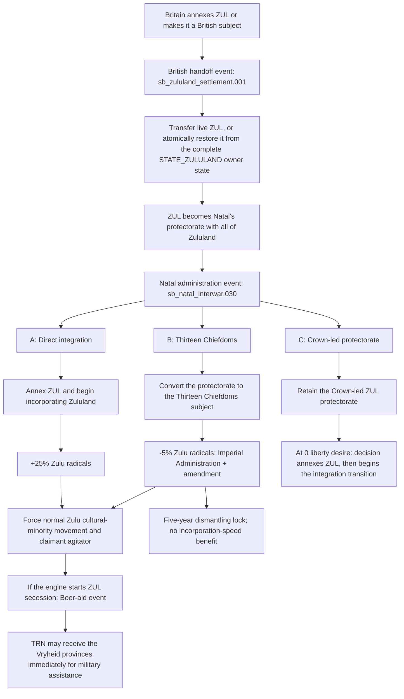
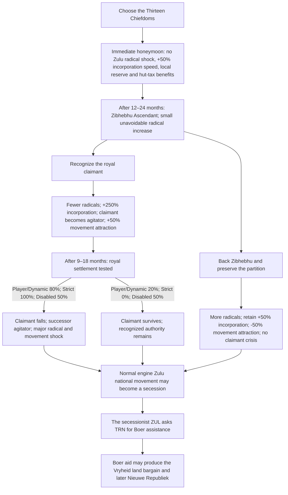
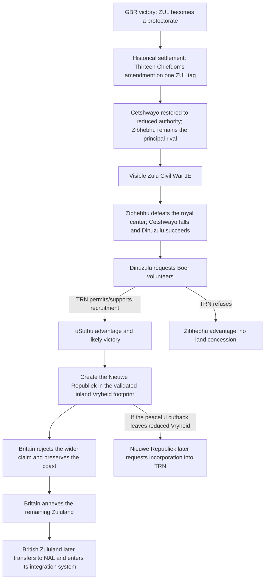
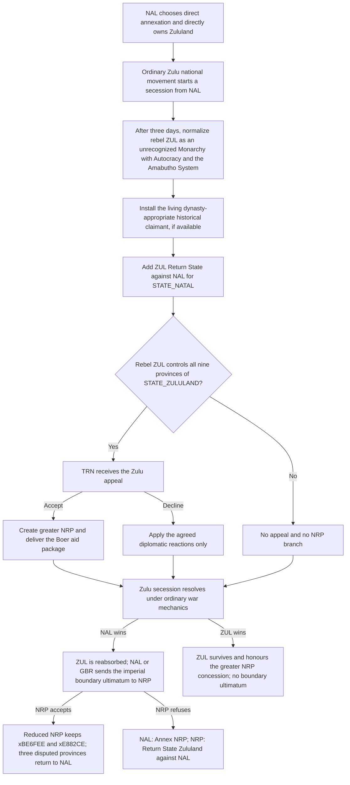

# Natal–Zululand Postwar Settlement — Live Design Record

Status: first implementation complete; runtime playtesting remains authoritative for engine-only behavior.

This file preserves the design discussion for rebuilding `sb_natal_interwar.030` and its downstream Zulu-restoration story. The **Decision register** is the authoritative implementation contract; earlier alternatives and later historical working lists are retained for audit context.

> **Implementation warning:** `Docs/natal_zululand_postwar_settlement_proposal.md` is a superseded snapshot that predates the Natal-administered ZUL, shared Chiefdoms Situation, and independent-NRP boundary design. Do not use it as the coding specification.

## Design problem

After Britain annexes ZUL or reduces it to a British subject, Britain receives the postwar handoff event. Accepting the handoff first gives Natal a complete ZUL protectorate—by transferring the existing subject or atomically restoring the complete Zululand owner-state—and then fires `sb_natal_interwar.030` for Natal. That event offers direct integration, the Thirteen Chiefdoms, or preservation of the subordinate Crown-led polity.

The three labels describe materially different constitutional settlements, but their actual gameplay was incomplete, partly hidden, and unevenly rewarding. The first implementation also left the Crown-led branch vulnerable to a one-province restoration if its delayed setup failed; the 2026-09-03 correction replaced that sequence with atomic full-state restoration.

### Branch terminology

- **Crown-led ZUL** means option C in the initial `sb_natal_interwar.030` settlement. It remains a protectorate under NAL, never enters the Thirteen Chiefdoms situation, and cannot create the Nieuwe Republiek.
- **Crown-restored ZUL** means an uSuthu/Crown victory after NAL first chose the Thirteen Chiefdoms. It remains the Chiefdoms branch's puppet rather than becoming a protectorate, but its ongoing liberty-desire source reverses to `country_liberty_desire_add = +0.05`.
- **Boer-backed Crown restoration** is the only Crown-restored outcome that can create NRP. It requires the persistent record of prior Boer aid as well as an uSuthu victory.

## Authoritative scope

- Audit and rebuild `sb_natal_interwar.030` and the immediate machinery selected by its three options.
- Preserve the normal engine-driven Zulu cultural-national movement for direct Natal rule. Story scripting should attach to an actual Zulu secession rather than replace the engine's uprising.
- Reconsider the bridge from the postwar settlement to the claimant, Boer-aid, and Vryheid/Nieuwe Republiek sequence.
- Do not redesign the Anglo-Zulu War itself in this pass.
- “Vryheid” is used for the northwestern Zululand/New Republic chain. Vryburg belongs to the separate Stellaland/Goshen/Bechuanaland story.

## Historical and mechanical anchors

- Britain imposed the thirteen-chief settlement after the 1879 conquest; the arrangement fragmented authority and contributed to civil war.
- Cetshwayo was restored to a reduced territory in 1883, was defeated by Zibhebhu, and died in 1884.
- Dinuzulu then obtained Boer volunteer support, and the resulting land claims produced the Nieuwe Republiek around Vryheid.
- Britain annexed the remaining Zululand in 1887; Natal annexed British Zululand only in 1897. The current game chain compresses this imperial administration into Natal because the whole state is handed to the NAL country after the war.
- Vanilla provides both ordinary `annex` and `annex_with_incorporation`. The revised Crown-led direction deliberately uses ordinary annexation so political union and administrative incorporation remain separate phases.
- The no-cultural-match incorporation base is 25 years. Centralization and Central Archives each add +5% incorporation speed, explaining an approximately 23-year 1879 tooltip. Speed modifiers change the rate rather than subtracting the displayed percentage from the duration.
- Vanilla AI ordinarily refuses to start incorporation if the predicted duration exceeds 8.5 years or the state has fewer than 100,000 people. This explains why AI Natal leaves Zululand unincorporated under the current long-duration setup.
- Vanilla's `add_movement_enthusiasm_modifier = yes` applies `initial_movement_enthusiasm`: +100% political-movement pop attraction, decaying over twenty years. Gates of the Bosphorus uses the same effect after locating a newly created cultural movement.
- Vanilla country-creation examples either create a country from a complete `region_state` or transfer explicit provinces inside `create_country.on_created`; they do not rely on an unguarded one-day completion step merely to establish the intended footprint.
- A country definition does not by itself define a releasable footprint. Vanilla's Release Country interface and `liberate_country` war goal read `common/country_creation`; ZUL's SB entry now gives it the ordinary two-state `STATE_NATAL` and `STATE_ZULULAND` geography. The bespoke postwar restoration deliberately passes only the complete `STATE_ZULULAND` owner state.

## Current flow



## Audit findings

### Event presentation

- Option A exposes only its raw +25% Zulu-radical effect. Creating the national movement and installing or generating its claimant are hidden without a tooltip.
- Option B exposes only its raw -5% Zulu-radical effect. The forced law, amendment, state modifier, five-year lock, bureaucracy-law lock, national movement, and claimant are hidden without tooltips.
- Option C places every material consequence in a hidden effect. It does not tell the player that ZUL will be restored, which territory it receives, its subject type, its starting liberty desire, or the later integration condition.
- The option labels therefore do not let the player compare the three constitutional and gameplay routes.

### Former Crown-led restoration defect — resolved 2026-09-03

- The country-restoration option is `.030.c`, not `.030.a`. Option `.030.a` never creates ZUL.
- The superseded implementation first created ZUL in `xBE6FEE`, then relied on a hidden next-day event to transfer the other eight provinces and establish the subject relationship.
- The live handoff now requires one British-controlled owner state covering all of `STATE_ZULULAND`, creates ZUL from that complete state in one `create_country` operation, and immediately normalizes the NAL–ZUL protectorate relationship before scheduling `.030`.
- Resolution markers are committed only after the full-state protectorate postcondition succeeds. Static tests reject any return of the seed-province, explicit province-transfer, subject-shell, or hidden-finalizer pattern.

### Vanilla release and liberation wiring

- The ordinary Release Country interface is backed by `common/country_creation/00_releasable_countries.txt`. A `ZUL = { states = { STATE_NATAL STATE_ZULULAND } }` entry would give both that interface and the `liberate_country` war goal ZUL's ordinary two-state geography.
- ZUL currently exists only in `common/country_definitions`. That supplies its tag, culture, rank tier, and capital once created, but not the territory used when releasing or liberating it.
- On paper, British Natal can have a nested subject: vanilla `subject_type_colony` and the mod's responsible-colony and dominion types all set `can_have_subjects = yes`; vanilla puppet is eligible for Release Country and permits a colonial overlord. The interface still applies runtime rank and diplomatic-relation checks, so this requires an in-game validation case.
- No script-level `release_country` effect is used by vanilla or Gates of the Bosphorus. The ordinary release is a UI action, not an event effect that `.030.c` can directly call. Gates uses `create_country` from a complete owner `region_state` and then creates the subject pact, which is the closest event-driven comparator.
- Consequently, native country-creation wiring can make ZUL generically releasable and liberatable, but `.030.c` still needs an atomic scripted creation path if selecting the option is meant to restore the country immediately.

### Integration routes

- A decision named `Integrate Restored Zululand` already partially implements DP's proposed shortcut. It is shown for a direct ZUL puppet and becomes usable at exactly 0 liberty desire while both countries are at peace and outside diplomatic plays.
- The decision bypasses ordinary annex-subject acceptance and resistance, but currently uses `annex`, not `annex_with_incorporation`. The player must therefore begin the culturally distant state’s long ordinary incorporation afterward.
- The restored country is already created as the lowest scripted subject type (`puppet`); the present route does not actually require another autonomy reduction, only lowering liberty desire from 75 to 0.
- Direct integration and the Thirteen Chiefdoms do not automatically begin state incorporation. They leave that vanilla action to NAL.
- The Thirteen Chiefdoms provide -25% qualifications, reduced radicalism growth from three acceptance bands, and +10% food security, but no incorporation-speed benefit.

### Chiefdom guard and lifecycle

- The amendment itself cannot be repealed through the law interface, and attempted bureaucracy-law changes are canceled.
- A separate decision can dismantle it after five years for +10% Zulu radicals. That is a time lock, not a lock tied to incorporating Zululand.
- The economic, food-security, qualification, and radicalism package is a state modifier placed only on NAL's `STATE_ZULULAND`. The amendment nevertheless forces Imperial Administration and guards Natal's bureaucracy law at country level.
- The Shepstone amendment's persistent modifiers are currently country-wide. Once NAL acquires Zululand, its subsistence-output, protected-employment, reserved-arable, and migration effects also spill into Zululand, even though its pop-conversion routines explicitly target `STATE_NATAL`. Adding a Chiefdoms reserve package without addressing that scope would stack both systems in Zululand.
- The chiefdom settlement is forcibly removed as soon as a Zulu secession begins. If Natal defeats the uprising, it is not restored.
- There is no general cleanup for losing Zululand by another route, and the state modifier is applied only to Natal's region-state at the moment the amendment activates.

### Claimant, secession, and Vryheid bridge

- Direct integration and the Thirteen Chiefdoms both explicitly create a normal vanilla `movement_cultural_minority` for Zulu culture. After creation, activism and secession are engine-driven.
- Before 1884, the claimant effect may generate a generic Zulu agitator. Monthly maintenance can later add Dinuzulu as another agitator, but it does not remove or supersede that generic claimant.
- If the Mbuyazi succession was chosen, the code uses Mbuyazi's scripted son and removes Dinuzulu's agitator role.
- The Boer-aid event is triggered by any engine-created ZUL secession against NAL. It has no date, claimant, settlement-path, or Dinuzulu gate.
- ZUL's AI always asks TRN for support when TRN exists. TRN's acceptance is dynamic, but accepted aid transfers the five scripted Vryheid provinces immediately while the secession is still under way.
- The subordinate-crown option does not create a national movement and does not enter this secession/Boer-aid chain. Its restored ruler can be Dinuzulu after 1884, but that is a separate code path.

## Fixed constraints

- Every material option effect must be legible before selection. Use raw effect tooltips where they are clean and custom tooltips for hidden technical work.
- Restoring ZUL must be atomic from the player's perspective and must give it the complete nine-province `STATE_ZULULAND` footprint.
- Direct integration, chiefly administration, and subordinate monarchy must be distinct, viable choices rather than one clearly dominated route.
- Direct rule must remain compatible with the engine's ordinary Zulu national movement and secession mechanics.
- The ordinary Zulu national movement begins when NAL is first established, with vanilla initial enthusiasm; the later settlement chain may shape that same movement but must not create a competing replacement.
- New or rewritten event localization must be marked `# ### TO REVIEW ###`, never `REVIEWED` by Codex.

## Decision surface

1. Exact reward and gate for integrating a loyal restored Zulu crown.
2. Exact Zululand-only socioeconomic package for the Thirteen Chiefdoms, including whether to replace the qualification penalty with a Shepstone-like chiefly-reserve system. The ten-year lock and +50% incorporation-speed value are settled.
3. Whether direct integration should remain the high-radicalism/no-administrative-aid route or receive another benefit.
4. Whether the Crown-led route can later produce a royalist independence crisis. It permanently opts out of the Thirteen Chiefdoms route to the Nieuwe Republiek.
5. When and how the historical claimant supersedes a generic early Zulu agitator.
6. Whether Boer aid is offered at secession start or after a claimant-specific prewar/civil-war checkpoint, and when the Vryheid land grant is paid.
7. AI weights for the three settlements and their downstream choices.
8. Cleanup behavior if NAL loses Zululand, ZUL changes subject type, either country dies, or a secession is defeated.
9. Static and runtime test contracts that prove full-state ownership and expose option outcomes.

> **Iteration note:** Decisions One through Ten below are retained as design history. Where they conflict with Decisions Eleven through Thirteen or the final Decision Register, the later material is authoritative; in particular, the older direct-ownership Chiefdoms model, agitator flow, and +250% incorporation package are superseded.

## First decision: Crown-led integration

### A. Instant incorporated union

Restore all of Zululand as a ZUL puppet of NAL at high liberty desire. Once it remains a direct level-one subject and reaches 0 liberty desire, NAL may use a decision that performs `annex_with_incorporation`.

- Makes the route difficult through subject management but gives a decisive reward for complete loyalty.
- Avoids the ordinary 75%-maximum subject-annex acceptance problem and the additional 23-year incorporation wait.
- Has no arbitrary date lock; the player's actual subject-management performance controls timing.

### B. Ordinary annexation with an integration transition

At zero liberty desire, replace the combined annex-and-integrate decision with an ordinary annexation decision. Upon annexation, begin incorporating `STATE_ZULULAND` automatically and apply a temporary state incorporation-speed modifier for ten years.

- Separates the subject-autonomy phase from the later administrative incorporation of its territory.
- Keeps the Crown-led protectorate the most stable and least direct settlement while still rewarding successful subject management.
- Prevents AI Natal from annexing ZUL and then leaving the state permanently unincorporated, provided the incorporation-start effect is validated.

The proposed +50% ten-year boost does not produce a roughly twelve-year integration. With a 25-year base and +10–20% technology speed, it takes approximately 16.7–18.2 years because the modifier expires before completion. A +100% ten-year boost produces approximately 12.5–13.6 years.

### C. Ordinary annexation without automation

Retain ordinary annexation and ordinary state incorporation after the subject has become loyal.

- Stays closest to generic subject mechanics.
- Leaves AI behavior unreliable and makes the route mechanically dominated.

Decision: **B**, using a ten-year **+100%** boost. Crown-led ZUL therefore remains the longest route in practice because its approximately 12.5–13.6-year incorporation phase begins only after the preceding subject-autonomy phase.

## Second decision: role of the native release system

### A. Native release only

Add ZUL to `country_creation`, but make the event option merely direct the player to the ordinary Release Country interface.

- Uses the standard player-facing action.
- Does not make `.030.c` self-contained, cannot guarantee the intended ruler, +75 liberty desire, firearm baseline, or subject relation, and leaves AI execution awkward.

### B. Hybrid: canonical footprint plus atomic event restoration

Add `ZUL = { states = { STATE_NATAL STATE_ZULULAND } }` to `country_creation`, then rebuild `.030.c` as one atomic `create_country` operation from NAL's complete `STATE_ZULULAND` region-state only, followed immediately by the subject and restoration setup.

- Makes ordinary Release Country and Liberate Country understand Zululand everywhere.
- Keeps the postwar choice deterministic for both player and AI and preserves its bespoke settlement consequences.
- Removes the fragile seed-province/follow-up sequence without inventing a replacement release system.

### C. Event-only restoration

Fix `.030.c` atomically but do not add a `country_creation` entry.

- Is the narrowest code change.
- Leaves ZUL anomalously unavailable to the standard release and liberation systems despite having a clear one-state footprint.

Decision: **B, agreed**. The ordinary country-creation footprint covers Natal and Zululand, while `.030.c` restores only postwar Zululand. The atomic event effect is still needed because the UI release action is not exposed as a normal scripted effect and cannot carry the branch-specific setup.

## Third decision: socioeconomic model for the Thirteen Chiefdoms

### A. Minimal substitution

Remove the -25% qualification penalty and add protected subsistence employment and reserved arable land to the existing Zululand state modifier, leaving the current country-wide Shepstone modifiers untouched.

- Directly answers the qualification concern with few changes.
- Allows the Shepstone and Chiefdoms packages to stack in Zululand whenever the former remains active, making the result depend heavily on an earlier Natal choice.

### B. Separate state-scoped land systems

Move the Shepstone amendment's persistent land and subsistence effects into a `STATE_NATAL`-only modifier, while the Thirteen Chiefdoms receive their own `STATE_ZULULAND`-only chiefly-reserve package. Remove the Chiefdoms qualification penalty.

- Makes the geographical distinction explicit: the Shepstone locations govern Natal, while the thirteen-chief partition governs conquered Zululand.
- Prevents accidental stacking and lets the two packages be balanced independently.
- Preserves the agreed +50% incorporation speed in Zululand without importing Natal's indenture, pop-conversion, or yearly labor-transfer machinery.

A sensible first testing package for the Chiefdoms would be +25% subsistence output, 50% protected subsistence employment, 15% reserved arable land, -15% migration pull, and +50% incorporation speed, alongside the existing modest radicalism reductions. The subsistence-output effect would replace the current generic +10% food-security bonus rather than stack with it. These values deliberately make it a weaker and less coherent land settlement than the Shepstone system.

### C. Retain the qualification model

Keep -25% qualifications and add only the agreed incorporation-speed benefit.

- Continues to represent weak access to colonial education and administration.
- Uses a broad population-wide penalty to model a land-and-authority settlement and does not distinguish it cleanly from simple underdevelopment.

Scope decision: **B, agreed**. The persistent Shepstone land system applies only to `STATE_NATAL`; the Thirteen Chiefdoms package applies only to `STATE_ZULULAND`. The exact Chiefdoms values remain a first-test proposal rather than a settled package.

## Fourth decision: Shepstone–Indenture dependency

### A. Hard contractual lock — rejected

While `je_sb_natal_indenture_program_v2` is active, Natal cannot repeal the Shepstone amendment or enact a law change that would remove it. Suspending recruitment does not close the JE and therefore does not unlock repeal. Once the JE completes or becomes invalid for an external reason, the existing Shepstone repeal conditions apply again.

- Makes the land settlement a prerequisite that Natal must maintain for the lifetime of the labour scheme it enabled.
- Prevents an exploit in which Natal opens indenture, removes the political and land-policy concession, and continues recruiting.
- Retaining the JE's present Shepstone validity check is still useful as a fallback for exceptional or scripted removal.

### B. Repeal terminates indenture — agreed

Allow repeal once the Shepstone System's fixed 25-year protection period expires, regardless of whether the Indenture JE is active. Repeal then invalidates the Indenture JE and applies the existing repeal reaction.

- Preserves player freedom and makes repeal a consequential way to terminate the scheme.
- Does not satisfy the stronger interpretation that the indenture contracts politically lock in the Shepstone settlement while recruitment continues.

### C. Preserve the current one-way dependency

The JE requires Shepstone, but the amendment itself does not explicitly check whether the JE is active.

- Is the least intrusive arrangement.
- Leaves the interface able to offer an action whose principal consequence is to invalidate another active system.

Final decision: **B**. The amendment itself carries a 25-year repeal lock. The active or suspended Indenture JE adds no further lock; if Shepstone is repealed after that period, the JE's existing validity rule closes the scheme.

## Fifth decision: hut-tax revenue

Both chiefly land settlements can carry a small local tax benefit representing hut-tax collection:

- Shepstone: apply it only to NAL's `STATE_NATAL` modifier.
- Thirteen Chiefdoms: apply it only to NAL's `STATE_ZULULAND` modifier.

### A. Local land-tax addition

Add a small `tax_land_add` value to each state modifier. This is the closest mechanical description of a per-hut or peasant-household levy, and Hail Columbia provides a comparator for using `tax_land_add` in a state modifier.

- Best matches the named institution and places the fiscal burden where the chiefly settlement applies.
- Needs a focused runtime check that the modifier remains state-scoped and that its revenue at each tax level is genuinely small.

Suggested first test: `tax_land_add = 0.05` in each applicable state, with no extra country-wide tax effect.

### B. Improved local tax collection

Use `state_tax_collection_mult = 0.05` instead.

- Is unambiguously state-scoped and modest.
- Represents administrative efficiency across all taxes rather than a new land levy, so its tooltip and economic meaning are less exact.

Working recommendation: **A**, subject to the runtime scope and revenue test. Fall back to **B** only if `tax_land_add` does not behave locally or produces an outsized return.

## Sixth decision: the partition crisis and Zulu restoration

The underlying idea is strong: the Thirteen Chiefdoms should look like the administratively easiest settlement at first, then reveal the instability created by placing rival chiefs above the royal house. The earlier proposed sequence was too linear. Zibhebhu's rise, Cetshwayo's return, the claimant's death, and Boer intervention should not all occur on every branch.

Two historical corrections constrain the rewrite:

- Zibhebhu was the principal rival of Cetshwayo's and later Dinuzulu's uSuthu faction. He should not lead the restored ZUL side and then ask the Boers for help.
- Cetshwayo's death should not be scripted as a proven assassination. Contemporary suspicion can appear in the prose, but the event should treat the cause as unresolved.

Victoria 3 supplies separate levers for the two kinds of resistance involved:

- `add_radicals_in_state` changes the number of locally discontented Zulu pops.
- A modifier on the Zulu cultural movement can independently alter `political_movement_pop_attraction_mult`, `political_movement_radicalism_add`, or activism growth.

This makes DP's proposed tradeoff mechanically legible: recognizing the king can reduce diffuse anger while giving national restoration a stronger focus; backing Zibhebhu can produce more angry Zulu pops while keeping the royalist movement fragmented.

### Provisional top-level settlement roles

| Settlement | Territorial form | Integration | Stability and cost |
| --- | --- | --- | --- |
| Restored subordinate crown | ZUL remains a separate NAL subject | No progress while separate; after ordinary annexation, automatically begin an approximately 12.5–13.6-year integration transition with +100% speed for ten years | Most stable for Natal because Zulu pops remain under their own homeland government, but subject liberty desire must be managed |
| Thirteen Chiefdoms | NAL directly owns Zululand under a visible amendment | +50% initially; the historical recognized-authority branch is calibrated to finish around 1887 | Moderate initial stability, local land restrictions and hut tax, followed by a delayed factional crisis |
| Direct administration | NAL directly owns Zululand with no settlement amendment | Ordinary incorporation speed | Immediate large radical shock and national movement, but no reserved-land, protected-employment, bureaucracy-law, or chiefly-administration constraints |

The Crown route is now mechanically the slowest and least direct: the autonomy phase is followed by, rather than replaced by, ordinary state incorporation.

### Stage 1: Zibhebhu ascendant

Schedule a visible event **12–24 months** after choosing the Thirteen Chiefdoms. It describes Zibhebhu emerging as the strongest of the appointed chiefs and conflict between his supporters and the uSuthu royalists. It applies a small unavoidable Zulu radical increase in `STATE_ZULULAND`, provisionally +5%, before offering two policies.

#### A. Recognize the royal claimant

- Replace the Thirteen Chiefdoms amendment with a visible, locked `Recognized Zulu Authority` amendment rather than leaving two settlements active at once.
- Reduce Zulu radicals in Zululand, provisionally by 10%.
- Preserve the local reserve and hut-tax system and raise the state incorporation bonus from +50% to the agreed first-test value of +250%, representing the administrative advantage of dealing through one recognized authority and calibrating the historical route to the 1887 target.
- Create or find the normal Zulu national movement.
- Transfer or recreate the actual pre-conquest royal claimant in NAL and give that character the agitator role.
- Give the Zulu movement a provisional +50% attraction and -10% movement radicalism while the royal settlement holds.
- Clearly warn that recognition ends the Thirteen Chiefdoms arrangement and risks concentrating opposition around the restored claimant.

This is reconciliation without political disarmament: fewer radical pops, substantially faster administration, but a broader and more coherent restoration movement.

#### B. Back Zibhebhu and preserve the partition

- Retain the Thirteen Chiefdoms amendment and its +50% incorporation bonus.
- Add a larger Zulu radical increase in Zululand, provisionally another +10%.
- Do not install the royal claimant as an agitator.
- Apply a provisional -50% attraction modifier to the Zulu national movement for as long as the partition remains active. If the movement does not yet exist, store the outcome and attach the modifier when it appears, using the same synchronization pattern already used by the Shepstone reactions.

This is coercive fragmentation: more unrest and turmoil, but a smaller and less unified restoration movement. It does **not** schedule the claimant-death sequence below.

### Stage 2: the royal settlement tested

This stage belongs only to option A. Schedule it 9–18 months after recognition. A dynamic 80/20 outcome is mechanically feasible, but the minority result should be a real outcome rather than a silent no-op:

- **80% — the claimant falls:** the claimant is defeated and dies soon afterward; the cause of Cetshwayo's death remains deliberately ambiguous. Remove the old agitator, install the recorded dynastic successor, add a major one-off Zulu radical increase, and give the movement a stronger radicalism/activism modifier. The recognized-authority amendment remains until incorporation completes; the claimant's fall changes its political consequences rather than ending the administrative system mid-process.
- **20% — the royal settlement holds:** Zibhebhu is checked, the claimant remains alive and remains the movement's agitator, the recognized-authority amendment persists, and the major succession radical shock does not occur.

The claimant outcome follows a settled game-rule matrix:

| Controller / AI-history setting | Claimant falls | Royal settlement holds |
| --- | ---: | ---: |
| Player NAL | 80% | 20% |
| AI NAL — Strict-Historical | 100% | 0% |
| AI NAL — Dynamic-Historical | 80% | 20% |
| AI NAL — Disabled | 50% | 50% |

The AI-history rule does not alter a player's roll. “Disabled” removes the scripted historical bias rather than deleting the story event, so its two mechanically valid outcomes receive neutral odds.

Claimant succession must follow the recorded pre-conquest dynasty rather than testing the date alone:

- Cetshwayo line → Dinuzulu.
- Mbuyazi line → a defined son of Mbuyazi.
- Dingane/Uthumbo line → a defined next-generation claimant; the exact historical identity needs verification before a character is authored.

The clean implementation anchor is to preserve the conquered Zulu ruler and heir as flagged exiled characters when ZUL is destroyed. The delayed event can then promote the character who actually lost the kingdom instead of guessing from the date or generating a generic agitator.

### Stage 3: engine secession and Boer aid

Neither Stage 1 nor Stage 2 directly launches a diplomatic play. The ordinary Zulu cultural movement remains responsible for becoming secessionist. When it actually creates ZUL:

- transfer the current royal agitator or successor to ZUL and install that character as ruler;
- offer the Boer-aid event to the secessionist ZUL;
- if TRN accepts, continue into the Vryheid land bargain and later Nieuwe Republiek machinery.

Zibhebhu remains the Natal-aligned rival and never asks the Boers for help.

The revised flow is:



Working recommendation: use this three-stage, movement-based flow. It preserves player-visible V3 mechanics, removes the forced historical domino chain from the Zibhebhu branch, and gives the two policies genuinely different risk profiles.

## Seventh decision: incorporation lifecycle and completion

### Historical-speed calibration

Assuming a 25-year no-match base, +10% technology speed, and an initial 12–24 months under the +50% Chiefdoms modifier, the total time from the 1879 settlement is approximately:

| Recognized-authority bonus | One-year initial phase | Eighteen-month initial phase | Two-year initial phase |
| --- | ---: | ---: | ---: |
| +75% | 13.65 years | 13.72 years | 13.78 years |
| +200% | 8.55 years | 8.79 years | 9.03 years |
| +250% | 7.50 years | 7.78 years | 8.06 years |
| +300% | 6.71 years | 7.01 years | 7.32 years |

The agreed first-test historical value is therefore **+250%**, not +75%. This places full incorporation around 1886–1887 for a 1879 settlement while naturally satisfying vanilla AI's 8.5-year willingness gate once the recognized-authority phase begins. Vanilla itself uses a +200% incorporation-speed event modifier, so this scale is not outside the game's modifier vocabulary.

### Automatic start

All NAL-owned settlement routes should begin incorporation automatically rather than relying on AI discretion:

- Direct administration: begin incorporation immediately when `.030.a` resolves, for both player and AI NAL. This is an explicit branch effect rather than a request left to vanilla AI behavior.
- Thirteen Chiefdoms: begin incorporation when `.030.b` resolves, before the delayed Zibhebhu event.
- Crown-led ZUL: `.030.c` cannot begin state incorporation at selection because it transfers `STATE_ZULULAND` to the newly established ZUL protectorate. Mark the route at `.030.c`, then begin incorporation immediately when the zero-liberty-desire decision ordinarily annexes ZUL. This automatic start applies to both player and AI NAL.

The engine binary exposes `start_incorporation` and `start_incorporation_of_state` identifiers, but no vanilla scripted usage has yet been located. Their scope and syntax must be validated before implementation. If they cannot safely begin normal progress, the fallback is a narrowly scoped exception in both vanilla AI incorporation triggers for AI NAL owning `STATE_ZULULAND`; instant `incorporate = yes` is not an acceptable substitute.

### Locked settlement and completion event

The Thirteen Chiefdoms and Recognized Zulu Authority amendments cannot be manually repealed. They remain active until `STATE_ZULULAND` becomes fully incorporated, including if their claimant or movement circumstances change.

The code `on_state_incorporation` should schedule a one-shot event, **The Annexation of Zululand**, when all of the following are true:

- the incorporated state is `STATE_ZULULAND`;
- its owner is NAL;
- NAL has either settlement amendment;
- the completion event has not already resolved.

The event removes the active Zululand settlement amendment, its state and movement modifiers, its bureaucracy-law guard, and its hut-tax arrangement. It does not remove the ordinary Zulu national movement or its agitator: incorporation is an administrative milestone, not automatic cultural pacification.

If NAL loses Zululand before incorporation completes, cleanup removes the orphaned settlement machinery without firing the celebratory annexation event. If incorporation is canceled, the settlement remains active.

## Eighth decision: the Zulu movement at Natal's creation

When the NAL country is first established and its intended territory has been assigned, it should ensure that its ordinary Zulu `movement_cultural_minority` exists. The newly created or pre-existing matching movement then receives vanilla's `add_movement_enthusiasm_modifier = yes`, giving it +100% pop attraction decaying over twenty years.

This should be a one-shot country-creation effect:

- cover every genuine first creation of NAL, whether the country begins as Boer Natalia or is created directly as British Natal;
- run after territory and population transfer so the movement sees NAL's actual Zulu population;
- do not refresh the twenty-year modifier when an existing Boer NAL becomes British Natal, on reload, or when later settlement events merely ensure that the movement still exists;
- use the Gates of the Bosphorus pattern of creating the movement, locating the matching Zulu cultural movement, checking that it does not already have `initial_movement_enthusiasm`, and applying the vanilla helper;
- separate movement creation from `sb_natal_ensure_zulu_restoration_agitator`. Natalia's foundation creates a normal national movement, not an anachronistic Dinuzulu or generated restoration claimant. The claimant is attached only when the later postwar settlement stage calls for one.

Decision: **agreed**. Refactor the current combined helper into a base “ensure Zulu national movement” effect and a later claimant-installation effect, then call only the base effect from NAL's shared post-creation setup.

## Ninth decision: Anglo-Zulu War outcome bridge

The approved settlement assumes that Britain first annexes ZUL and hands `STATE_ZULULAND` to NAL. Replacing the annex-country play with a standard protectorate play is mechanically possible, but the protectorate's destination determines whether the three-way settlement survives:

- An immediate transfer of the protectorate to NAL effectively preselects the Crown-led route. Direct Administration and the Thirteen Chiefdoms cease to be real options.
- Keeping ZUL directly under GBR preserves an imperial layer but removes immediate Natal agency and requires a later British-Zululand transfer phase.
- A temporary direct GBR protectorate can act as a military bridge. A prompt imperial settlement would dissolve and transfer it for Direct Administration or the Thirteen Chiefdoms, while the Crown-led option would reparent the surviving subject to NAL.

The temporary-protectorate hybrid is the working recommendation if historical staging is worth additional machinery. A generic protectorate is not a sufficient final representation of the 1879 partition because it leaves a centralized Zulu polity intact. If the hybrid is rejected, retain annex-country: it preserves the approved Natal-facing settlement better than either permanent-protectorate alternative.

This remains **open**. The current Anglo-Zulu implementation is unchanged until the bridge is selected. The consolidated proposal is recorded separately in `Docs/natal_zululand_postwar_settlement_proposal.md`.

## Tenth decision: Nieuwe Republiek and the post-partition conflict

Bringing the Nieuwe Republiek into scope reopens the war bridge and the Thirteen Chiefdoms branch. Historically, the republic was not payment for Zulu assistance in a rebellion against Natal. It followed Britain's 1879 partition, Cetshwayo's constrained restoration, Zibhebhu's defeat of the uSuthu, Dinuzulu's recruitment of Boer volunteers, and the volunteers' victory at Tshaneni. Britain then restricted the claimed concession, retained the coast, annexed the remaining Zululand in 1887, and allowed the separate New Republic to enter the SAR as Vryheid in 1888.

The report's historical constraint is therefore strong: if the Nieuwe Republiek is represented as historical content, it should be born from the internal uSuthu–Zibhebhu conflict and should initially exist as a frontier republic rather than becoming an immediate TRN province.

### A. Literal engine civil war

Keep ZUL as a GBR protectorate under the Thirteen Chiefdoms and drive a normal revolution or secession between the royal claimant and Zibhebhu.

- Provides mobilized armies, fronts, allies, and a real military outcome.
- A normal civil war cannot simply be launched by event; script can create or influence the political movement and its civil-war progress, but the engine controls escalation and the revolutionary country.
- Splitting one nine-province state between a subject and its revolution is fragile. GBR may be pulled automatically behind its subject government, making Boer “volunteers” fight Britain directly and turning a local succession struggle into an imperial war.
- The dynamic revolutionary tag and postwar ownership would need extensive recovery logic before a deterministic Vryheid concession could be applied.

Decision: **rejected**. If the historical post-partition route is selected, its internal war will not be a literal engine civil war.

### B. Visible civil-war journal entry with real territorial consequences

Represent the thirteen chiefs through one ZUL protectorate, one amendment, characters, and a visible **Zulu Civil War** journal entry. Do not create thirteen countries or a temporary Zibhebhu country. The JE records the balance between the uSuthu claimant and Zibhebhu, while events apply the war's devastation, casualties, displacement, and political consequences.

The provisional historical sequence is:



The JE is an abstraction of the internal war, not an abstraction of its territorial results:

- ZUL remains the single protectorate representing the fragmented post-1879 order.
- Cetshwayo, Zibhebhu, Dinuzulu, and the Boer commandants are real characters attached to the relevant side.
- Boer aid changes the JE balance and imposes diplomatic, military, and political costs on TRN; it does not transfer land immediately.
- A successful uSuthu–Boer alliance creates a real Nieuwe Republiek country from a historically validated inland province list.
- The Nieuwe Republiek initially remains separate from TRN, with close ties and weak fiscal/security conditions; a later 1888-style event or decision offers incorporation into the SAR.
- Zulu pops remain in the ceded territory. A land-concession modifier represents surveyed Boer farms, tenant status, hut-tax claims, and contested legitimacy.
- Britain retains the coastal and remaining Zululand fragment and later annexes it directly. It does not give the New Republic an Indian Ocean outlet.

If Zibhebhu wins or Boer assistance is refused, no Nieuwe Republiek is created. Britain may still annex the unstable protectorate later.

Assessment: best historical-mechanical compromise. It keeps the conflict visible and interactive while avoiding a fragile one-state subject civil war. The only new permanent map actor is the country that historically existed.

### C. Preserve the existing Natal-restoration rebellion

Keep the approved direct-rule/Chiefdoms design in NAL. Let the normal Zulu national movement rebel against Natal, and let ZUL offer Vryheid for TRN support in that war.

- Preserves the clean engine-driven uprising and the existing three-route Natal tradeoffs.
- Treats a conflict against Natal as the cause of the concession, rather than the uSuthu struggle against Zibhebhu.
- Giving the land directly to TRN repeats the report's stated failure mode: the New Republic becomes an ordinary SAR expansion instead of a separate frontier republic.

If this fallback is retained, a successful bargain should still create a separate Nieuwe Republiek and only later offer incorporation into TRN. It should be presented as an alternate-history Vryheid settlement, not the historical 1884 sequence.

### D. Compressed Natal-administered partition

Retain the current British annexation and handoff to NAL, followed by the existing three-way `sb_natal_interwar.030` choice. On the Thirteen Chiefdoms route only, represent the uSuthu–Zibhebhu conflict through the same visible-JE architecture proposed in B.

- NAL already owns Zululand, so the British protectorate, 1887 Crown annexation, and 1897 transfer are compressed into one earlier imperial handoff.
- The Thirteen Chiefdoms remain an internal settlement amendment rather than a literal collection of subjects.
- Cetshwayo, Zibhebhu, Dinuzulu, and Boer intervention retain their historical causal roles.
- Successful Boer intervention creates a separate Nieuwe Republiek in the inland Vryheid footprint; NAL retains the coastal and remaining Zululand fragment.
- The New Republic later joins TRN, while NAL continues incorporating its reduced Zululand fragment.
- Direct Administration retains the ordinary engine-driven Zulu national movement and potential secession. Crown-led ZUL retains its protectorate route and cannot create NRP. Only the historical Thirteen Chiefdoms route uses the internal-conflict JE and may later produce Crown-restored ZUL.

This is less chronologically exact than B but preserves the Natal player's existing agency and settlement tradeoffs. It also avoids leaving player NAL as a spectator while ZUL remains a direct GBR protectorate until 1897.

Revised working recommendation: **D** as the gameplay-first compromise. It preserves the strongest part of the historical Nieuwe Republiek sequence—partition, rival Zulu factions, Boer volunteers, a coerced concession, an independent frontier republic, and later SAR incorporation—while deliberately compressing Britain's separate 1879–97 administration into NAL. Choose B instead only if the separate British-protectorate and British-Zululand phases are themselves important enough to justify a longer, more scripted chain with less Natal agency.

Status: **superseded as the top-level choice by the Eleventh-decision proposal below**, but retained as the comparison that produced it. The only agreed architectural constraint from this round is that the uSuthu–Zibhebhu conflict will not use a literal engine civil war.

## Eleventh decision: Natal-administered ZUL and the Chiefdoms situation

DP's revised architecture makes the chain Natal content without abandoning ZUL as a real political object. Britain first defeats or subordinates ZUL, then hands responsibility to NAL. Regardless of whether the British war formally annexed or made a protectorate, the handoff normalizes the result to a complete ZUL protectorate under NAL before Natal chooses the settlement.

This is mechanically feasible in principle:

- vanilla `transfer_subject` can reparent an existing ZUL subject directly;
- if Britain annexed ZUL, the handoff can atomically restore the complete nine-province country before creating the NAL–ZUL relationship;
- vanilla colony and both SB responsible-colony subject types set `can_have_subjects = yes`; and
- NAL is a recognized principality, while a protectorate accepts a recognized or colonial overlord of sufficient rank.

The final implementation still needs a runtime `can_have_as_subject` validation for NAL's actual rank and country state. Handoff must not destroy or strand ZUL if the nested relationship is temporarily invalid.

### British handoff

After a British victory or accepted subordination:

1. GBR receives a visible event offering administration of Zululand to NAL.
2. AI GBR always accepts. A player GBR may instead choose direct British administration.
3. On acceptance, ZUL is or becomes a complete `subject_type_protectorate` directly under NAL.
4. NAL immediately receives the three-way **Government of Zululand** event.

NAL remains Britain's subject, so GBR is still the ultimate imperial overlord. The nested ZUL relationship is the gameplay abstraction that exposes the chain to a Natal player.

If player GBR retains direct responsibility, the branch ends the temporary ZUL polity and places the complete Zululand state under direct British rule. The transfer must be followed by a substantial Zulu-radical shock and creation of GBR's ordinary Zulu cultural-national movement. That movement remains engine-driven; the imperial branch must not substitute a bespoke scripted revolt. The exact radical percentage is still open.

### The three Natal settlements

#### A. Destroy the Crown

- Annex ZUL directly into NAL.
- Begin normal incorporation of `STATE_ZULULAND` immediately.
- Only after ownership transfers, apply the large Zulu radical effect in the annexed Zululand state so the effect cannot miss its intended pops.
- Ensure and strengthen NAL's ordinary Zulu national movement.

#### B. The Thirteen Chiefdoms

- Preserve ZUL as a country but exile and persist the existing royal ruler and relevant heir.
- Install Zibhebhu as the ruler who personifies the dominant chiefly settlement; this represents fragmentation without creating thirteen tags.
- Lower ZUL from autonomy level 2 to autonomy level 1.
- Under a recognized/colonial NAL, the valid vanilla level-one relationship is mechanically `subject_type_puppet`, not `subject_type_vassal`. “Vassal” may remain descriptive prose, but a custom subject type is not justified merely to change the label.
- Apply Zibhebhu's dependence as an ongoing liberty-desire source of `country_liberty_desire_add = -0.05` while the Chiefdoms situation is active. This is the requested continuous modifier; it must not be replaced by a repeated `add_liberty_desire = -5` point pulse.
- Block ordinary annexation and further subject-autonomy changes between NAL and ZUL while the Chiefdoms situation remains unresolved. Otherwise the falling liberty desire could let the player bypass the situation. A Zibhebhu settlement retains the accumulated low liberty desire when the lock lifts; a Crown-restored settlement keeps the puppet relationship but replaces the negative ongoing source with its positive one.
- Add a mild initial Zulu radical reaction, provisionally 2–5%, in both `STATE_NATAL` and `STATE_ZULULAND` after all ownership and subject changes settle.
- Open the shared Chiefdoms International Situation.

#### C. Subordinate the Crown

- Keep ZUL as NAL's high-autonomy protectorate.
- Retain the royal ruler and dynasty.
- Add Zulu loyalists and the stable-subordinate-crown settlement effects.
- Preserve the slower autonomy-management and later-integration route. When NAL eventually annexes this Crown-led protectorate, incorporation begins normally with **no** temporary speed bonus, guaranteeing that this remains the longest integration path.

### Chiefdoms International Situation

The situation is technically a shared Journal Entry in `je_group_global_international_situations`, following the existing Bechuanaland and Imperial Confederation patterns. A global container owns the score and phase flags; every involved country receives a projection of the same bar and tag-specific buttons.

Provisional involvement:

- NAL: principal player and sponsor of Zibhebhu's settlement;
- ZUL: the chiefly subject in which the contest occurs;
- TRN: involved only while it controls at least one designated East Transvaal frontier province and remains capable of supporting the royal faction; and
- GBR: visible as ultimate overlord, but preferably an observer or one-shot guarantor rather than a second routine controller that displaces NAL.

The single bar represents effective political and military dominance inside ZUL:

- one pole: Zibhebhu and the Natal-backed chiefly order;
- the other: the exiled Crown and the uSuthu loyalists.

The bar is not a literal civil war. Events, buttons, Zulu radicalism, claimant survival, ZUL's internal stability, Natal expenditure, and Boer support move the balance. Events can still apply devastation, deaths, displacement, or political shocks where the represented conflict requires them.

### Situation timing and resolution — agreed

- The shared situation becomes visible immediately when NAL selects the Thirteen Chiefdoms.
- The principal balance is a `0–100` double-sided bar: `0` represents Crown/uSuthu dominance and `100` represents Zibhebhu/Natal dominance. It begins at `60`, reflecting the initial advantage created by Natal's imposed partition.
- It has an 18-month protected opening phase. Reaching a full endpoint during this phase does not resolve it before month 18, allowing the claimant, intervention, and explanatory event sequence to surface.
- From month 18 onward, reaching full progression at either end resolves the situation immediately for that side.
- If neither side reaches full progression, month 60 is the hard timeout and whichever side is then leading wins. An exact tie resolves for the Crown/uSuthu: parity is enough for royal legitimacy to overturn the imposed chiefly settlement, while Zibhebhu must finish strictly ahead to preserve it.
- Resolution is one-shot. The container freezes its score, stores the winning side and prior-Boer-aid state, closes every country projection, and suppresses delayed situation events that have not yet fired.
- There is no generic passage-of-time drift in the first design pass. Structural drift from economic dependence and Natal's bureaucracy, together with deliberate Natal and Boer actions, must first be calibrated as the complete movement model. A neutral passive term should be added only if playtesting shows that this system otherwise stalls.

### Proposed NAL actions

#### Increase policing

- A reversible NAL action costs `100` Authority while active and applies `0.5` point of monthly movement toward Zibhebhu.
- It represents Natal actively sustaining the imposed chiefly order rather than creating economic dependence a second time.
- It may operate alongside the returned-claimant drift, exactly cancelling that `0.5` monthly uSuthu movement while Natal continues paying the Authority cost. Activation cooldown, AI use, and automatic shutdown under an Authority deficit remain open.

#### Unload Zulu refugees

- A one-shot NAL decision or Chiefdoms JE button transfers exactly `5%` of the Zulu peasant people in Natal proper to ZUL-owned Zululand, removes the Shepstone system, and moves the situation `5` points toward uSuthu.
- The transfer must be proportional by people, not a chance applied to whole pop objects; otherwise a few large pops can make the nominal five-percent effect wildly inaccurate.
- The action uses the same fixed 25-year Shepstone lock as ordinary repeal. The Indenture JE does not add a second lock; using the action after that period invalidates any active or suspended scheme through its existing Shepstone validity rule.
- This is a committed alternative to ordinary repeal. It directly applies the existing Shepstone-repeal consequences once, suppresses `sb_natal_interwar.055`, and therefore never exposes that event's immediate **We were mistaken** restoration option.
- Its tooltip must prominently disclose that the action dismantles Shepstone, moves five percent of Natal's Zulu peasants, applies the repeal reaction, suppresses the normal reconsideration event, and gives uSuthu `5` situation points. This intentional finality is part of why the action is preferable to triggering `.055` through an ordinary repeal.
- Behavior when ZUL controls too little Zululand to receive the full transfer remains open.

#### Allow Cetshwayo or the stored claimant to return from exile

- The action creates approximately `20%` Zulu loyalists in Natal proper and establishes `0.5` point of monthly movement toward the Crown/uSuthu for the remainder of the situation.
- The claimant must use the dynasty-aware stored claimant rather than hard-coding Cetshwayo when another succession branch has occurred.
- Returning from exile does not restore the claimant as ZUL's ruler. The character returns to ZUL's character pool as the stored royal/uSuthu claimant and must still win the principal balance before taking the Crown. The situation bar already represents the royal contest, so the claimant should not also be made an engine agitator unless runtime testing demonstrates that a character with no active role cannot be retained safely.
- Pressing this action is the sole gate for the later claimant-death event. If NAL never permits the return, neither Cetshwayo nor the dynasty-appropriate alternative is killed by this situation chain.
- The drift belongs to the continuing royal claim rather than to the individual character. Claimant death does not remove or interrupt it because the dynasty-appropriate heir succeeds to the claim.

### Proposed structural NAL drift

- ZUL's economic dependence on NAL supplies the economic component. Greater dependence moves the main balance toward Zibhebhu/Natal; low or absent dependence moves it toward the Crown/uSuthu.
- The implementation should read the engine's `economic_dependence` value once and translate it into score bands. It must not separately add market access, investment, foreign ownership, subject autonomy, or the other inputs already represented by that value.
- Agreed continuous formula: `0.5 × clamp(economic_dependence − 1, −1, +1)` points toward Zibhebhu per month. Dependence `0` therefore gives `0.5` uSuthu movement, `1` is neutral, `1.5` gives `0.25` Zibhebhu movement, and `2+` caps at `0.5` Zibhebhu movement. This inverts and bounds the same dependence relationship that vanilla uses for liberty desire.
- NAL's bureaucracy supplies a distinct administrative component. A surplus moves the balance toward Zibhebhu; a deficit moves it toward the Crown/uSuthu, and exact zero produces no movement.
- The widening-band proposal is superseded by a direct smooth-value proposal. This is supported by vanilla's Austrian scripted progress bars, which read `this.relative_bureaucracy` directly inside the bar calculation. No threshold buckets are required.
- DP's refined target is a concave response: retain the `±0.10` non-zero base impulse, distinguish even small differences around zero, and make each additional percentage point contribute progressively less as the ratio approaches `±100%`. Merely raising the cap cannot create that shape because it affects only extreme values.
- Agreed first-test function: let `x = clamp(|b|, 0, 1)`, where `b` is NAL's decimal `relative_bureaucracy`. Then use `f(x) = 0.9 × (2x − x²)` and:
  - `drift(0) = 0`;
  - `drift(b) = sign(b) × min(0.1 + f(x), 1)` when `b ≠ 0`.
- This is a quadratic ease-out curve. Its marginal slope is highest at zero and falls continuously to zero at `x = 1`. The `0.9` scale reserves the first `0.1` for the non-zero impulse while making a `100%` surplus or deficit reach the existing `±1` cap exactly. It can be expressed with vanilla-supported value, multiply, subtract, minimum, and maximum operations; no square-root or exponent operator is required.

| Absolute `relative_bureaucracy` | Monthly magnitude |
|---:|---:|
| `0%` | `0.000` |
| just above `0%` | just above `0.100` |
| `1%` | `0.118` |
| `2.5%` | `0.144` |
| `5%` | `0.188` |
| `10%` | `0.271` |
| `25%` | `0.494` |
| `50%` | `0.775` |
| `75%` | `0.944` |
| `100%+` | `1.000` |

- Apply the magnitude toward Zibhebhu for a surplus and toward uSuthu for a deficit. The exact-zero discontinuity is intentional: a perfectly balanced administration contributes nothing, while either a genuine surplus or deficit makes the administration politically relevant.
- Together bureaucracy and economic dependence replace generic passive drift in the first test package.

### Proposed Boer-commitment bar and actions

The Thirteen Chiefdoms situation should expose a second `0–100` progress bar, following the vanilla Ryukyu pattern of showing a political balance and a distinct escalation/progress measure in one International Situation. This bar represents how far TRN has committed money, networks, and manpower to the uSuthu cause; it is not a second measure of who is winning inside Zululand.

- An uSuthu victory on the principal bar is necessary but not sufficient for the Nieuwe Republiek concession.
- The Boer-commitment bar must also reach `100`. Reaching `100` stores the existing Boer-aid commitment and patron record but does not resolve the principal bar.
- Full Boer commitment followed by a Zibhebhu victory creates no republic. An uSuthu victory without full Boer commitment restores the Crown without a territorial concession.

#### Sponsor the uSuthu faction

- A reversible TRN action pays an ongoing monetary cost.
- While active it moves the principal balance toward the uSuthu and fills the separate Boer-commitment bar each month.
- The agreed package is a `£250` weekly budget charge, `0.25` point of monthly uSuthu movement, and `2` Boer-commitment progress per month.
- AI stops sponsorship when it is both in deficit/debt and has negative weekly cash flow. It activates when it has positive cash reserves or weekly cash flow of at least `£500`.
- Turning sponsorship off stops the charge and both monthly movements but does not erase accumulated Boer commitment.

#### Sanction Boer volunteers

- This is an ongoing TRN policy rather than a one-shot burst. While active it applies a `1%` mortality-rate penalty to TRN servicemen, produces `0.5` point of monthly movement toward the uSuthu, and adds `3` Boer-commitment progress per month.
- Turning it off ends the mortality and both monthly movements without erasing accumulated commitment. Activation rules and AI safety conditions remain open.

The second bar is recommended. It separates the military-political outcome in ZUL from the contractual threshold for earning land, gives both actions visible cumulative meaning, and prevents one cheap intervention from satisfying the entire Nieuwe Republiek prerequisite.

### Proposed situation-event layer

The event layer should punctuate the five-year contest rather than supply constant monthly noise. Every playthrough receives the opening settlement event, each of the three one-shot ambient incidents in a randomized order, and one terminal event. Only claimant return and death can add the conditional claimant/Boer sequence.

#### Event cadence and spam guard

- All three ambient incidents below fire exactly once in a randomized order. They are not a repeating pool.
- No two non-terminal situation events may appear within `60` days of one another. A due event is deferred until the shared cooldown expires rather than discarded.
- To make “always fires” literal despite resolution becoming possible at month 18, the randomized queue should place all three ambient incidents inside the protected opening phase. A suitable first-test schedule is the first event after `90–180` days and each subsequent event after another `61–150` days.
- Claimant death/survival and the Boer appeal use the same shared 60-day spacing guard. The terminal resolution event is exempt because the situation must resolve as soon as its agreed endpoint condition is met.
- All outstanding incident and claimant timers are cancelled when the situation resolves.

#### Ambient incident pool

1. **A Skirmish among the Chiefdoms.** The event makes a neutral `50/50` roll. A Zibhebhu victory adds `5` points; an uSuthu victory subtracts `5` points. It fires once and reports the selected outcome rather than offering NAL a costless choice of winner.
2. **Enforcing the Hut Tax.** Rival authority over the levy forces NAL to choose. Enforcing collection produces `5` points of uSuthu movement. Relaxing collection produces `5` points of Zibhebhu movement but reduces ZUL's monthly payment to NAL. The exact payment reduction and duration remain open.
3. **A Chief Changes Sides.** This deterministic social comparison fires once. If average Zulu acceptance in NAL is at least `50` **and** average Zulu SoL in NAL is at least average Zulu SoL in ZUL, the result is `5` points toward Zibhebhu. If either test fails, the inverse result is `5` points toward the uSuthu.

The incidents should not recalculate economic dependence or bureaucracy. Those variables already act through structural monthly movement; using them again as incident weights would double-count the same political conditions.

#### The returned claimant dies

- This event can be scheduled only after NAL has used **Allow [Claimant] to Return from Exile** and while that returned claimant remains alive and actively contests the settlement.
- For Cetshwayo, the title and historical prose should not assert proven assassination. His death may be surrounded by poisoning or assassination rumours, but the recorded cause remains unresolved. An alternate-dynasty claimant can use adapted prose without claiming Cetshwayo's exact circumstances.
- If the claimant survives, apply `7` points of uSuthu movement and leave that character as the active claimant.
- If the claimant dies or is assassinated, apply `10` points of Zibhebhu movement, remove the returned claimant, and make the dynasty-appropriate successor the active uSuthu claimant: Dinuzulu for Cetshwayo's line, the selected son for Mbuyazi's line, and a deliberately invented next-generation successor for the Dingane/Uthumbo line.
- Uthumbo and that invented successor must both be identified internally and in research notes as speculative characters. Their event prose may present them as people in the game world, but must not claim that either identity is historically verified.
- If an eligible TRN exists, the successor produces **An uSuthu Appeal to Pretoria**. It may be folded into the claimant-death notification for AI–AI play, but a player TRN receives the request visibly. The appeal is an immediate opportunity for material aid, not a gate on the separate sponsorship or volunteer buttons.
- An accepted Boer appeal transfers `500` servicemen people from TRN to ZUL, adds `20` points to Boer commitment, and applies `7` points of uSuthu movement. The source must have sufficient servicemen; behavior when fewer than 500 are available remains open.
- Player TRN receives a genuine choice. Accepting performs the transfer and immediate score effects; declining performs none of them. Neither answer locks **Sponsor the uSuthu** or **Sanction Boer Volunteers**—those situation actions remain independently available while their ordinary conditions are met.
- AI TRN uses situation-aware weights. Strict Historical accepts whenever the material transfer can be performed. Dynamic Historical accepts at `80%` while the uSuthu strictly lead the principal balance and `60%` otherwise; default or declared bankruptcy forces refusal. Disabled uses neutral `50/50` weights. These AI weights never constrain a player TRN.
- The claimant retains the earlier death/survival rule matrix: player NAL and Dynamic Historical use `80/20`, Strict Historical guarantees death, and Disabled uses `50/50`.

#### Completed Boer commitment

- There is no separate land-bargain event. Reaching `100` silently stores the completed commitment and TRN patron scopes and updates the visible situation status.
- It neither creates NRP nor resolves the principal balance. If the uSuthu later win while the bar is complete, their terminal event immediately creates the Nieuwe Republiek; a Zibhebhu victory creates no republic.
- Once NRP has been created, only a human-controlled TRN receives a `play_as = c:NRP` offer. Continuing as TRN is the default option. Player NAL and every other participant receive no switch offer; an AI TRN requires none.

#### Terminal events

- **Zibhebhu victorious:** confirms the chiefly order and applies the agreed post-situation dependency, incorporation, and radical consequences.
- **The Crown restored, without a completed Boer bargain:** installs the surviving claimant or dynasty-appropriate successor and produces Crown-restored ZUL without NRP.
- **The Crown restored, with completed Boer commitment:** installs the claimant/successor, creates the greater Nieuwe Republiek concession, and schedules the separate imperial boundary demand.

This event budget gives the situation a recognizable story without recreating every local clash or forcing the historical sequence in games where NAL never permits the claimant's return. A run without claimant return receives five situation popups across as many as five years; the full claimant-and-player-TRN route adds at most two more, subject to the shared 60-day spacing guard.

### Terminal architecture

The constitutional endpoints are agreed. The bar establishes who dominates the post-partition order; a terminal settlement then translates that political result into the correct puppet drift, territory, unrest, and any New Republic concession. Exact unrest values and later annexation mechanics remain open.

Three materially different resolution classes now exist even if the visible bar retains two poles:

#### Zibhebhu consolidates the settlement

- NAL retains a route to all nine Zululand provinces.
- ZUL remains a low-autonomy puppet with the Crown suppressed or kept in exile.
- NAL pays through money, bureaucracy, worsening Zulu radicalism, turmoil, and a stronger Zulu national movement in Natal.
- The `country_liberty_desire_add = -0.05` source used during the situation is replaced by `country_liberty_desire_add = -0.10`. Resolution lifts the annexation/autonomy lock, allowing a later annexation and incorporation of the full state.
- If NAL later annexes ZUL, normal incorporation starts immediately and receives a ten-year `+100%` Zululand incorporation-speed modifier.
- This remains a proposed result, not an agreed endpoint. In particular, the required unrest, minimum post-resolution waiting period, and whether annexation should be a decision or ordinary subject action remain open.

#### The uSuthu prevail without Boer intervention

- The stored dynasty-appropriate claimant returns as ZUL's ruler.
- ZUL remains NAL's puppet, but the Zibhebhu-dependence source ends and is replaced by `country_liberty_desire_add = +0.05`. This is Crown-restored ZUL, not the initial Crown-led protectorate.
- Zulu radicals fall or loyalists increase, but NAL's path to political integration becomes substantially longer.
- If NAL later annexes ZUL, normal incorporation starts immediately and receives a ten-year `+50%` Zululand incorporation-speed modifier.
- No Boer republic is created and no land is ceded merely because the royal faction prevailed.
- Its exact liberty-desire baseline, protection period, and later annexation route remain open.

#### The uSuthu prevail with prior Boer intervention

- The stored dynasty-appropriate claimant returns as the royal authority.
- The prior intervention flag converts the victory into a land-concession settlement and creates a separate Nieuwe Republiek in a validated inland Vryheid footprint.
- The New Republic initially receives the agreed larger concession, including the disputed coastal reach. Peaceful acceptance of the later imperial boundary demand cuts it back to the inland Vryheid footprint; refusal leaves the coast at stake in the reciprocal Return State play.
- The surviving reduced ZUL becomes Crown-restored: its royal ruler returns, it remains NAL's puppet, and it receives the same `country_liberty_desire_add = +0.05` source and post-annex `+50%` incorporation legacy as the non-Boer Crown victory.
- This is the only route that can create the Nieuwe Republiek. Boer intervention without an uSuthu victory creates no republic, and an uSuthu victory without Boer intervention creates no republic.

The two-part Nieuwe Republiek prerequisite is **agreed**. It preserves the historical causal bargain and gives TRN meaningful agency while preventing games without an eligible Boer frontier actor from producing an unexplained settler republic.

### New Republic and coastal settlement: map models

DP has selected explicit first-test footprints. DP confirmed that the supplied `939742` identifier means the existing map province `x9E9742`.

- Greater Nieuwe Republiek: `xE1E455 xE882CE xBE6FEE x904EBE x9E9742`.
- Reduced Nieuwe Republiek after peaceful cutback: `xBE6FEE xE882CE`.
- Peaceful cutback back to reduced Crown-restored ZUL: `xE1E455 x904EBE x9E9742`.

Both the greater and reduced NRP footprints are connected in the current adjacency manifest. The peaceful cutback restores the three disputed provinces to reduced ZUL. It does **not** annex them to Natal and creates no Natal corridor.

#### A. Create only the recognized inland republic

- On a Boer-backed uSuthu victory, create the Nieuwe Republiek directly in the final validated inland Vryheid footprint.
- Leave every coastal and excluded remainder province with the reduced ZUL subject under NAL.
- Represent the much larger 1884 concession through the settlement event, a contested-land modifier, and possibly a non-actionable journal status rather than temporary ownership.
- If it accepts the later imperial cutback and survives as reduced Vryheid, a later event lets the New Republic seek incorporation into TRN while the reduced ZUL coast follows its own Natal annexation or Crown-subordination route.

This produces the durable 1888 map immediately, avoids a one-tick coastal republic, and prevents temporary ownership from scrambling hubs, buildings, populations, incorporation, or AI war logic.

#### B. Create the greater claim, then let Britain cut it down — agreed

- Initially give the New Republic the broader claimed concession, potentially including territory toward the coast.
- Run a British/Natal boundary settlement that returns the coast and Melmoth/Proviso B to ZUL.
- This makes British restriction visible on the map and permits a player GBR to accept or reject the reduced boundary.

This is more dramatic but considerably more brittle: it requires two rapid province handoffs inside one state, exposes a temporary Indian Ocean outlet, and needs recovery logic if Britain cannot or will not impose the settlement.

#### C. Give land straight to TRN — not recommended

This avoids a new country but erases the Nieuwe Republiek's four-year independent existence and turns the volunteer bargain into ordinary SAR expansion. It remains contrary to the research brief and to the agreed requirement that Boer intervention create the republic rather than merely enlarge TRN.

Decision: **B, agreed by DP**. The Boer-backed uSuthu result creates the larger claimed concession as real temporary New Republican territory. A subsequent British boundary settlement cuts it back to the two-province inland Vryheid footprint and restores `xE1E455 x904EBE x9E9742` to reduced ZUL. No part of the accepted cutback goes directly to Natal.

### Autonomy-drift endpoint variants

“Autonomy drift” is implemented through liberty desire because subject autonomy level is discrete in Victoria 3. Here the decimal values are continuous `country_liberty_desire_add` modifiers, not monthly `add_liberty_desire` point pulses. The unresolved Chiefdoms phase already uses the agreed `-0.05` source while ZUL remains a puppet and subject actions are locked.

DP's new endpoint sketch is internally coherent if the endpoint rates are read as monthly:

- Zibhebhu/NAL victory strengthens the source to `country_liberty_desire_add = -0.10`, retains the Thirteen Chiefdoms settlement, gives a post-annex +100% Zululand incorporation bonus for ten years, and causes moderate Zulu radicalism.
- Crown/ZUL victory keeps ZUL as a puppet but restores the royal ruler, applies `country_liberty_desire_add = +0.05`, replaces the active settlement with `Legacy of the Thirteen Chiefdoms`, gives a post-annex +50% incorporation bonus for ten years, and reduces Zulu radicalism.
- Boer/TRN victory is the same Crown-restored puppet result plus the agreed larger New Republic concession and British coastal cutback. It exists only if the situation's persistent record shows that Boer aid was actually committed.

The incorporation modifiers are dormant while ZUL owns its state. They must be state legacies that survive the ownership transfer, or be re-applied when NAL later annexes its relevant Zululand fragment; otherwise they do nothing for Natal's integration.

Three materially different endpoint implementations were considered:

#### Variant 1: Pure drift and vanilla subject pressure — agreed

- Zibhebhu victory leaves the Thirteen Chiefdoms government as NAL's puppet and applies `country_liberty_desire_add = -0.10`.
- Crown victory restores the royal ruler but leaves ZUL as NAL's puppet and applies `country_liberty_desire_add = +0.05`. The Boer result applies the same positive source to reduced Crown-restored ZUL after the New Republic concession.
- The relevant continuous modifier remains active while its settlement and the NAL–ZUL puppet relationship persist. The value is clamped at the liberty-desire floor or ceiling, but reaching either limit does not itself change subject type.
- At low liberty desire NAL can pursue annexation of the Zibhebhu puppet once the situation lock ends. Crown-restored ZUL instead becomes increasingly defiant while remaining a puppet unless ordinary or later-agreed autonomy action changes that relationship.

This differentiates the two post-Chiefdoms outcomes without silently changing subject type. It also keeps Crown-restored ZUL mechanically distinct from option C's Crown-led protectorate. AI guidance remains necessary because neither end of the liberty-desire scale automatically annexes or frees a subject.

#### Variant 2: Drift to scripted constitutional thresholds — not selected

- The same monthly rates apply, but reaching 0 or 100 triggers a one-shot settlement.
- At 0 after a Zibhebhu victory, NAL unlocks a dedicated annexation route and the +50% incorporation legacy.
- At 100 after a Crown victory, ZUL automatically becomes a protectorate and the +25% legacy remains for a later annexation.
- The Boer result creates and then cuts back the New Republic before the reduced ZUL protectorate is established.

This is deterministic and AI-safe, but the Crown endpoint eventually converges on the direct Preserve the Crown option. The partition's scars and integration modifier would carry most of the remaining distinction.

#### Variant 3: Drift followed by a forced Natal settlement choice — not selected

- Zibhebhu's endpoint behaves as in Variant 1.
- Crown or Boer victory leaves ZUL as a puppet with `+0.05` monthly liberty desire until a threshold event forces NAL to recognize greater autonomy or defy the royal settlement.
- Recognition creates the protectorate and ends the drift; defiance preserves the puppet but produces a sharp movement/radicalism penalty and a likely autonomy crisis.
- In the Boer case, the New Republic concession and coastal cutback occur regardless of Natal's later constitutional choice because the territorial bargain has already been paid for military assistance.

This creates the most player-facing drama and makes Crown victory consequential without silently rewriting the relationship. It also adds another event and gives NAL a chance to partially undo a result the bar was supposed to decide.

Decision: **Variant 1, agreed by DP**. The Thirteen Chiefdoms under Zibhebhu is a puppet. Crown-restored ZUL—whether full or reduced by the Boer-backed New Republic concession—also remains a puppet but receives rising liberty desire. Only option C creates Crown-led ZUL as a protectorate, and that branch cannot create NRP.

### Persistent record of Boer aid

Use the shared International Situation container as the authoritative ledger, following the existing Bechuanaland pattern:

- TRN's sponsorship and volunteer actions build the separate Boer-commitment bar;
- reaching `100` on that bar atomically sets `sb_zululand_boer_aid_committed_var` on the container, while later action changes cannot erase the completed commitment;
- the container also stores `sb_zululand_boer_patron_scope = c:TRN`, so later events can identify the assisting republic for relations, New Republic diplomacy, and eventual incorporation talks; and
- a mirrored country flag on TRN may drive its UI and cleanup, but it is not the authoritative condition.

Once aid has actually been delivered, the historical fact persists even if TRN later changes government, leaves the situation, or dies. An uSuthu victory may still create the New Republic; the stored patron scope determines whether TRN receives the later incorporation offer, while a missing patron leaves the republic independent until another explicitly designed route applies.

Status: **larger concession and coastal cutback agreed; pure-drift endpoint package agreed; Crown-led/Crown-restored distinction agreed; separate Boer-commitment bar proposed; Boer-aid ledger recommended and mechanically evidenced**.

## Twelfth decision: New Republic patronage and the coastal confrontation

DP selected a real boundary confrontation rather than an automatic British ruling or a single British choice event. The larger New Republic therefore survives until an imperial demand is answered. The first formulation below addressed that demand to TRN as NRP's overlord; DP has since reopened the relationship in favour of a fully independent NRP linked to TRN through compacts.

### Earlier subject-based confrontation flow — superseded

1. A Boer-backed uSuthu victory creates the New Republic in the larger claimed concession.
2. The same atomic setup makes NRP a subject or associated dependency of the stored Boer patron, normally TRN.
3. After a short visible interval, GBR demands that TRN accept the restricted boundary and surrender the coastal and Melmoth/Proviso B provinces back to reduced ZUL.
4. TRN may accept. The explicit cutback province list transfers from NRP to ZUL, NRP retains the recognized inland Vryheid footprint, and the NRP–TRN relationship continues.
5. TRN may refuse. GBR launches a locked boundary diplomatic play against TRN with an `Impose the Zululand Boundary` primary demand. NRP joins its patron's side; British-aligned NAL and the beneficiary ZUL belong on Britain's side where their actual subject relationships do not already place them there.
6. British victory or TRN backing down enforces the explicit province cutback. TRN victory preserves the larger concession and therefore gives NRP the alternate-history coastal outlet.

A standard `return_state` war goal is insufficient because both the larger concession and the intended cutback are province fragments inside `STATE_ZULULAND`. The confrontation needs a locked scripted play and a custom enforcement path that transfers the validated province list to ZUL. This also makes the third-party beneficiary explicit rather than accidentally awarding the whole state fragment to GBR.

This subject-based form is superseded. Its earlier open timing does not govern the independent-compact flow below.

### NRP's relationship with TRN

Making NRP a TRN subject is a useful gameplay compression: it makes TRN responsible for the concession, gives the British demand a stable recipient, ensures military alignment on refusal, and creates a clean bridge to the later 1888 incorporation. It is less literal historically because Pretoria formally kept its distance and the New Republic initially maintained its own institutions. The relationship should therefore preserve NRP's separate ruler, flag, map identity, and meaningful domestic autonomy.

Three mechanical forms are available:

#### A. Vanilla vassal

- Produces reliable war alignment and a direct later annexation path.
- Uses TRN's map colour, prevents NRP from starting its own plays, and represents much tighter control than the historical relationship.
- Vanilla also requires an unrecognized regional- or major-power overlord of higher rank, so creation can fail if the contemporary TRN does not meet that rank.

Assessment: too subordinate and not runtime-safe enough.

#### B. Vanilla tributary

- Preserves NRP's separate colour, ruler, and diplomatic activity and represents a looser high-autonomy dependency.
- Does not automatically join the overlord's wars, so the boundary confrontation must add NRP explicitly to TRN's side.
- It retains the same restrictive vanilla overlord-rank requirements and introduces ordinary tributary payments that are not the central historical relationship.

Assessment: closer visually, but still mechanically conditional and semantically awkward.

#### C. Custom Associated Republic — recommended

- A narrowly scoped high-autonomy relationship based on the loose features of a tributary: separate ruler, flag, map colour, and domestic identity.
- Accepts TRN as an unrecognized overlord at any relevant Boer-republic rank and does not require TRN to outrank NRP.
- Can be configured to join the specific boundary confrontation reliably without making NRP an automatic participant in every unrelated TRN war.
- Carries no generic tribute unless a later balance decision adds a small fiscal obligation.
- Cannot be freely converted through ordinary autonomy actions; the historical 1888 incorporation event or decision owns the transition into TRN.

Assessment: the additional subject type is justified only if DP wants NRP visibly subordinate to TRN from creation. It expresses patronage rather than pretending that the republic was already an ordinary SAR province or vassal.

Earlier recommendation: **C**. This is superseded as the working recommendation by the independent-compact model below, but remains the fallback if a reliable compact cannot be represented.

### Relationship edge cases

- If the stored Boer patron has died before the uSuthu victory, NRP still forms because aid was delivered, but begins independent and receives the British demand itself unless a successor-patron rule is later agreed.
- If TRN is already a subject of GBR, Britain cannot sensibly launch a normal external diplomatic play against its own subject. The cutback needs an internal-imperial resolution or an option for player TRN to break with Britain before defying it.
- If TRN is subject to a third power, the confrontation may need to target that ultimate overlord while retaining TRN as the decision-maker. This is a genuine edge case and should not be silently handled as though TRN were independent.

### NRP begins independent with the full Boer compact — agreed

DP's revised structure creates NRP as an independent republic before the imperial boundary demand and gives it the full Boer compact. The defensive pact is not redundant: it expresses Pretoria's initial public commitment, while the later TRN event tests whether Pretoria will honour that commitment once Britain or Natal forces the boundary question.

Agreed flow:

1. Boer-backed uSuthu victory creates independent NRP in the larger concession and gives it its own ruler, government, flag, colour, and diplomacy.
2. NRP receives the standard Boer country package and the existing 25-year compact with the stored patron TRN: a defensive pact, reciprocal transit rights, and reciprocal trade privileges. Its Great Trek JE targets `STATE_ZULULAND`.
3. Exactly 30 days after NRP is created and its Boer compacts are established, the constitutionally appropriate imperial actor demands the recognized boundary from NRP. GBR leads while NAL remains an ordinary British colony; self-governing or independent NAL leads in its own name, with British backing where the imperial relationship still applies.
4. If NRP accepts, `xE1E455 x904EBE x9E9742` return to reduced ZUL and NRP survives in `xBE6FEE xE882CE`.
5. If NRP refuses, TRN receives the defensive-commitment event. Acceptance turns NRP into TRN's existing Boer confederal-partner subject before the locked diplomatic play begins. Refusal breaks the defensive pact, reduces NRP–TRN relations by 50, and leaves NRP as principal. Union with TRN cannot resolve while the boundary demand or war remains active.

The compact is real and visible, and its existing treaty helpers should be reused rather than duplicated. The scripted commitment event owns the transition into confederal subjecthood or the explicit repudiation of the defensive pact, so the two branches cannot leave contradictory military obligations behind.

The standard Boer package has one explicit economic exception for NRP. Before carving out its fragment, every pre-existing building level associated with the transferred Zululand territory remains with or is reconstructed for ZUL. NRP inherits none of those levels and receives exactly one new livestock ranch; it receives no maize farm because the selected footprint has limited arable land. This relocation must preserve total existing building levels rather than deleting them during the split.

The 30-day demand is one-shot. Its delayed-event lifecycle must suppress duplicates and invalidate cleanly if NRP or Crown-restored ZUL ceases to exist, either side no longer owns a fragment of `STATE_ZULULAND`, or the boundary has already been resolved by another route.

### Demanding authority — constitutional split agreed

- **GBR leads** when NAL remains an ordinary `subject_type_colony` beneath Britain.
- **NAL leads** when it is independent or has any self-governing British status used by the mod: `subject_type_sb_responsible_colony`, `subject_type_sb_responsible_colony_monarchy`, `subject_type_dominion`, or `subject_type_sb_dominion`.
- When self-governing NAL remains a British subject, GBR backs NAL where the diplomatic-play relationship permits it. Independent NAL acts on its own unless ordinary diplomacy brings Britain in.
- The selected initiator owns the demand event and starts the play, but ZUL and NRP—not the initiator—hold the agreed reciprocal Return State goals over the two Zululand fragments.

This preserves British initiative under direct colonial rule while allowing a player who has won responsible government or greater autonomy to control Natal's own frontier policy.

### Initiator fallback — agreed

- A temporary blocker—an active war, diplomatic play, or another condition that can clear without changing the constitutional result—defers the demand rather than changing its initiator or resolving the boundary silently.
- If the constitutionally selected actor is dead or permanently unable to act, the other of GBR and NAL becomes the initiator if it is alive and eligible.
- If neither GBR nor NAL can issue the demand, the demand lapses and NRP retains its larger concession permanently. That uncut republic remains independent and never receives the reduced-Vryheid TRN-union route.
- Deferred or transferred demands retain the original one-shot identity. Recovery cannot schedule a second demand or reset the NRP-union clock after the boundary has resolved.

### Refusal war-goal variants

#### A. Britain or Natal annexes NRP

- Uses a familiar annex-country demand and makes refusal genuinely existential.
- If GBR is the holder, victory leaves British-owned province fragments that then need another handoff to NAL or ZUL.
- If NAL is the holder, the result depends on Natal having enough diplomatic autonomy to lead the play.

#### B. Reciprocal return-state claims — agreed

- Britain or NAL leads the play, but ZUL holds a `return_state` demand against NRP for NRP's fragment of `STATE_ZULULAND`.
- NRP holds the reciprocal `return_state` demand against ZUL for ZUL's remaining fragment of `STATE_ZULULAND`; TRN backs NRP in the play.
- A British/ZUL victory therefore extinguishes NRP and restores its complete concession to ZUL. An NRP/TRN victory transfers the remaining Zululand fragment to NRP and extinguishes ZUL.
- This expresses the stakes cleanly: peaceful acceptance preserves both a reduced New Republic and reduced Crown-restored Zululand, whereas refusal turns the competing territorial claims into an existential contest.
- It uses a standard whole-fragment outcome rather than requiring a custom province-level war goal. The accepted diplomatic settlement still performs only the agreed coastal cutback.

#### C. Enforce only the boundary cutback

- Refusal risks only the provinces Britain originally demanded.
- Requires the custom province-list enforcement described above.
- It is more proportionate but gives NRP less reason to accept before a war when Boer backing appears credible.

Decision: **B, agreed by DP**. The peaceful answer is a reduced but surviving republic. If the demand becomes a diplomatic play, ZUL and NRP carry reciprocal Return State goals over the other's Zululand fragment, so either claimant may eliminate the other through victory or backdown enforcement.

### Later incorporation into TRN

Only the reduced Vryheid polity created by peaceful acceptance of the imperial boundary demand enters the ordinary union phase:

- its incorporation petition fires 24 months after accepting the cutback; and
- NRP asks first, then TRN accepts or refuses, so a player on either side retains agency. Historical AI accepts on both sides.

Crown-led ZUL cannot coexist with NRP because choosing the initial protectorate branch bypasses the Thirteen Chiefdoms situation entirely.

Refusal never creates a Vryheid eligible for this scheduler. The reciprocal Return State confrontation is existential: a ZUL victory extinguishes NRP, while an NRP victory gives it the complete Zululand state and extinguishes ZUL. Both conclusions clear or suppress every reduced-Vryheid union timer. This is true whether TRN accepted or declined the request to lead NRP's defence.

For a peacefully reduced Vryheid, the scheduler uses a fixed 24-month deadline from acceptance. A petition that has already resolved cannot be scheduled again. An uncut NRP retained after a completely lapsed demand remains independent and never enters this scheduler.

Status: **confrontation agreed; NRP begins independent with the Boer compact; boundary acceptance is the sole route to reduced Vryheid and its later union petition; refusal commits NRP to an existential Return State confrontation and can never schedule Vryheid's union; a permanently lapsed demand leaves the uncut NRP independent; boundary demand fixed at 30 days; constitutional GBR/NAL initiator split and fallback agreed; reciprocal Return State goals agreed; accepted-cutback fixed 24-month union timing agreed**.

## Thirteenth decision: refusal and TRN's defensive commitment

DP proposes a single boundary decision followed, only after refusal, by a TRN response. This removes the duplicate paths in which NRP could first appeal and later decide whether to resist. NRP's first decision now settles the territorial question: acceptance is the only peaceful cutback, while refusal irrevocably commits NRP to the confrontation.

```text
Imperial boundary demand
├─ Accept
│  └─ NRP cedes the disputed coastal territory
│     └─ Reduced Vryheid later petitions to join TRN
└─ Refuse
   └─ TRN receives a defensive-commitment event
      ├─ TRN accepts
      │  └─ NRP becomes TRN's confederal partner
      │     └─ TRN leads the reciprocal Return State confrontation
      └─ TRN declines or cannot act
         └─ NRP remains independent and principal
            └─ The play proceeds through standard Victoria 3 diplomacy
```

NRP begins with the full Boer compact, including its defensive pact with TRN. If TRN accepts the request, NRP becomes its confederal partner before the diplomatic play begins, allowing TRN to serve as principal defender and NRP to join through the subject relationship. If TRN explicitly declines, that refusal breaks the defensive pact and reduces NRP–TRN relations by 50; NRP then fights as principal without a second scripted backdown or compact appeal. If TRN is unavailable, NRP likewise remains principal, but no relationship penalty is applied to a country that made no decision.

The reciprocal territorial goals remain attached to the actual fragments: ZUL seeks the NRP-held part of `STATE_ZULULAND`, and NRP seeks the ZUL-held part. Changing the principal defender must not silently replace these with an Annex Subject or other generic subject war goal.

### Agreed inputs to the dynamic decision

- NRP is not a playable country in the present scope, so its boundary response is always an AI feasibility decision rather than a player-facing choice.
- NRP's own army power projection does not affect its confidence in resisting.
- Boer strength is TRN's army power projection plus ORA's full army power projection when ORA is TRN's direct `subject_type_sb_boer_confederal_partner`. NRP's forces and other informal friends are excluded.
- If NAL is independent, a responsible colony, or a dominion, opposing strength is the regional `NAL + ZUL` army power projection pool.
- If NAL remains an ordinary British colony, opposing strength is `NAL + ZUL + aligned CAP + (GBR × 0.10)` army power projection. CAP is counted only while it is alive and belongs to Britain's subject hierarchy; an independent, non-British, or dead CAP contributes zero. Only ten percent of Britain's global projection is counted to represent deployable imperial backing.
- Dynamic-Historical uses the following Conservative refusal curve, where the ratio is Boer strength divided by opposing strength:

| Boer/opposition ratio | NRP refusal probability |
|---|---:|
| Below `0.50` | 5% |
| `0.50` to below `0.75` | 15% |
| `0.75` to below `1.00` | 35% |
| `1.00` to below `1.50` | 60% |
| `1.50` or above | 80% |

- Player-controlled TRN adds 10 percentage points after selecting the ratio band, capped at 95%. It favours resistance but does not guarantee it; the player is rewarded for building a strong Transvaal because actual TRN strength remains decisive.
- TRN receives the defensive-commitment event only if AI NRP first chooses refusal. A weak player TRN may therefore never be asked to intervene.
- If TRN no longer exists, Boer strength is zero and no support event can fire. Dynamic Historical therefore uses its lowest 5% refusal band, Strict Historical accepts, and Disabled remains 50/50; a refusal leaves NRP to fight as principal. The existing Boer-compact helper already has a direct creation fallback when ordinary treaty validation is unavailable, so missing treaty technology does not require another design branch while TRN is alive.
- AI–AI uses one shared strategic roll. If AI NRP's feasibility roll selects refusal, that result carries an AI-TRN commitment forward and AI TRN accepts the support request without a second roll. The supported-resistance probability is therefore the calculated probability, not its square.
- If TRN is player-controlled, NRP still makes the same feasibility roll first. Only a refusal exposes the support event to the player, who may honour or repudiate the pact.
- Strict Historical makes NRP accept the restricted boundary with certainty. Disabled gives Accept and Refuse neutral 50/50 odds. Dynamic Historical alone uses the Conservative strength curve and player-TRN bonus above.
- Dynamic Historical has a Hard Safety override: if TRN is in default, has the `declared_bankruptcy` modifier, is already at war, or is itself any kind of subject, NRP accepts the boundary with certainty and TRN receives no support request. This applies even when TRN is player-controlled. Ordinary debt, a running deficit, or depleted reserves do not independently change the odds.
- Disabled remains a true neutral roll and ignores the default, bankruptcy, and current-war parts of Hard Safety. Subject status is a mechanical safety condition rather than a historical bias, so it forces acceptance under every rule; Strict Historical already selects acceptance.

### Mechanical consequence of “confederal partner”

The existing `subject_type_sb_boer_confederal_partner` is mechanically available to an unrecognized TRN and guarantees that NRP follows TRN into the play. It gives NRP TRN's ruler and map colour, prevents NRP from starting its own diplomatic plays, and therefore makes Pretoria's assumption of the republic's defence visibly constitutional rather than merely diplomatic.

Decision: **reuse `subject_type_sb_boer_confederal_partner` unchanged**. Do not add an NRP-specific subject type or preserve a separate NRP ruler and map colour after TRN accepts. Vanilla `subject_type_protectorate` remains unsuitable because ordinary unrecognized TRN does not meet its overlord constraints.

Status: **single Accept/Refuse boundary decision agreed; refusal commits NRP to the play; TRN acceptance reuses the existing confederal-partner type unchanged and makes TRN principal; TRN refusal breaks the defensive pact and reduces relations by 50**.

## Fourteenth decision: engine Zulu secession and alternate-history Boer aid — confirmed

Status: **implemented on 3 September 2026; static validation complete**.

This pass concerns an ordinary engine-created Zulu cultural secession after NAL chose direct annexation in `sb_natal_interwar.030.a`, directly owns Zululand, and then fails to contain Zulu radicalism. It does not replace the Zulu national movement, force that movement to rebel, or reuse the internal Thirteen Chiefdoms situation as a second rebellion system. In particular, it is distinct from the earlier uSuthu–Zibhebhu route and its ZUL–NRP boundary confrontation.

### Current implementation audit

- `on_secession_start` supplies NAL as `ROOT` and the uprising country as `scope:target`. SB already detects a ZUL secession in that hook and opens the Boer-aid story.
- The engine-created ZUL initially inherits NAL's constitutional order. Its restoration package must therefore run after the engine has finished creating the secession country, rather than directly inside the first secession callback.
- The existing accepted-aid effect does not create NRP. It immediately transfers `xE1E455 xE882CE x1A084B xBFA16B x41C070` from `STATE_ZULULAND` to TRN, then creates a five-year treaty containing military assistance and only 10 units of small arms. This is the confirmed legacy province transfer and is to be replaced, not corrected in place.
- The existing greater-NRP footprint is `xE1E455 xE882CE xBE6FEE x904EBE x9E9742`; the reduced footprint after the imperial boundary settlement is `xBE6FEE xE882CE`.
- Vanilla supports multiple goods-transfer articles in one treaty, so grain and small arms can be represented separately. A treaty `binding_period`, however, is a minimum lock rather than an automatic expiry; a genuinely three-year aid package therefore needs explicit 36-month cleanup.
- The military contingent is a Dragoons unit, avoiding the incompatible technology requirement attached to Shrapnel Artillery. Artillery is not transferred as treaty goods.

### Working flow



### Decision register for this pass

#### Agreed

- Preserve the ordinary engine-driven Zulu national movement and secession.
- Three days after secession starts, restore ZUL as an unrecognized Monarchy rather than allowing the completed engine setup to retain NAL's parliamentary republic. The Transvaal appeal is queued only after that restoration option executes, so it cannot race the government and dynasty normalization.
- The restoration activates Monarchy, Autocracy, and the Amabutho System. It does not reapply ZUL's complete 1836 baseline or overwrite the uprising country's inherited economic, religious, citizenship, slavery, or taxation laws.
- If a dynasty-appropriate historical claimant is alive, install that character as ZUL's ruler.
- Claimant priority follows the archived pre-annexation dynasty: first the living named historical former ruler, then the living named historical heir selected by that line, then its living named successor. Cetshwayo's line may pass to Dinuzulu; the counterfactual Mbuyazi line may use its explicitly fictional named fallback only after its historical candidates are gone. Random vanilla heirs never displace a surviving named candidate. If the recorded line is exhausted, retain an engine-generated Zulu monarch rather than resurrecting a dead character.
- Failed or negotiated British annexation attempts discard the archived royal-house snapshot without reinstalling it over any legitimate succession that occurred while ZUL remained alive.
- Give secessionist ZUL a Return State war goal against NAL for `STATE_NATAL`.
- Remove the direct legacy transfer of five provinces to TRN.
- A successful Transvaal intervention creates NRP in the already agreed greater footprint: `xE1E455 xE882CE xBE6FEE x904EBE x9E9742`.
- This branch reuses NRP's complete existing setup: NRP begins independent; inherits TRN's technology; receives the limited Boer frontier law packet only for Government Principles, Distribution of Power, Citizenship, Economic System, and Army Model; receives one livestock ranch and no maize farm; opens the Great Trek JE targeting Zululand; and receives the defensive-pact, reciprocal-transit, and reciprocal-trade compact with TRN. Player TRN receives the existing option to switch to NRP; continuing as TRN remains the default.
- The Transvaal appeal fires only if rebel ZUL controls the complete nine-province `STATE_ZULULAND`. Partial control suppresses the event entirely: there is no aid choice, no NRP, and no appeal-related diplomatic reaction. The ordinary secession continues unchanged.
- Acceptance costs TRN £10,000 paid to ZUL; transfers 1,000 Boer servicemen from TRN to ZUL; gives ZUL one Dragoons unit; and creates grain 10, small arms 10, and military-assistance support intended to last three years. TRN loses 5 relations with GBR and 15 with NAL.
- Declining reduces TRN's relations with ZUL by 20 and improves its relations with GBR by 5 and NAL by 15.
- Acceptance is not blocked by a manpower shortfall. It transfers up to 1,000 existing Boer servicemen from TRN to ZUL, using every available eligible person if fewer than 1,000 exist; it never creates people or converts civilian professions to fill the shortfall.
- If NAL defeats and reabsorbs the Zulu secession after NRP has formed, NAL or GBR sends the imperial boundary ultimatum to NRP. This is a NAL/GBR–NRP postwar issue; defeated ZUL is not recreated and is not a participant.
- In that Natal-victory boundary settlement, peaceful acceptance cuts NRP back to `xBE6FEE xE882CE` and returns `xE1E455 x904EBE x9E9742` to NAL. A visible NAL event executes and reports the transfer, and a livestock-ranch floor guarantees that the reduced republic retains one ranch. Refusal gives NAL an Annex NRP demand and gives NRP a reciprocal Return State demand for NAL-held `STATE_ZULULAND`. The constitutionally appropriate GBR/NAL actor may open the play, but the territorial war-goal holders remain NAL and NRP.
- If rebel ZUL wins after TRN has intervened, ZUL honours the land concession that purchased Boer assistance. Greater NRP survives in all five agreed provinces and receives no imperial boundary ultimatum from this branch.
- The existing Thirteen Chiefdoms/uSuthu NRP boundary chain remains unchanged: its beneficiary is living Crown-restored ZUL and its refusal play retains the already agreed reciprocal ZUL–NRP Return State demands.
- Player TRN always receives a genuine Accept/Refuse choice when the appeal's territorial gates are satisfied; fiscal distress does not disable either option.
- Strict-Historical AI TRN always refuses this appeal because the direct-annexation secession route to NRP is explicitly alternate history. Disabled uses neutral 50/50 odds. Dynamic-Historical retains the existing geopolitical weighting with a 60% acceptance base, modified by British relations, rivalry, Imperial Confederation involvement, British security arrangements, and opposition to Britain or Natal. AI default or declared bankruptcy forces Dynamic refusal.
- NRP is created immediately after TRN accepts. The `on_created` finalizer has an independent one-day fallback that either completes a live NRP or clears a failed setup lease. Any postwar boundary ultimatum remains dormant until the Zulu secession ends, preventing another scripted diplomatic play from overlapping the live NAL–ZUL secession.
- The aid agreement uses separate grain and small-arms transfer articles plus military assistance and is explicitly terminated after 36 months. Its binding period alone is not treated as an expiry date.
- The supplied Nieuwe Republiek flag is installed as NRP's runtime coat of arms, and `xE882CE` (Vryheid) is prime land.
- Oranje's Kimberley discovery route now opens at Nitroglycerin rather than Dynamite, matching its reduced technology package.

#### Open

No design choices remain open.

## Decision register

### Agreed

- The persistent Shepstone land-and-subsistence system affects `STATE_NATAL` only; it does not spill into Zululand.
- Direct administration (`.030.a`) explicitly begins incorporating Zululand for both player and AI NAL rather than leaving the action to vanilla AI's long-duration gate.
- The Crown-led integration decision uses ordinary annexation rather than `annex_with_incorporation` and automatically begins normal incorporation of Zululand with no temporary speed bonus. Its preceding protectorate phase plus ordinary incorporation makes it the longest route.
- A player GBR who rejects the handoff uses direct British administration: GBR owns the complete Zululand state, receives a substantial Zulu-radical shock there, and creates an ordinary engine-driven Zulu cultural-national movement.
- NAL's first creation ensures a normal Zulu cultural-national movement and applies vanilla Initial Enthusiasm for Movement once. Later tag transformation or settlement maintenance does not refresh it, and the foundation hook does not install a restoration agitator.
- If the uSuthu–Zibhebhu conflict is modelled, it will not use a literal engine civil war.
- The Nieuwe Republiek is created only when an uSuthu victory follows prior Boer intervention. Neither condition is sufficient by itself.
- Zibhebhu's dependence during the situation is a continuous `country_liberty_desire_add = -0.05` source. It is not a repeated `add_liberty_desire = -5` pulse or a static -50-point modifier.
- A Boer-backed uSuthu victory initially creates the larger claimed New Republic as real territory; Britain subsequently cuts it back from the coast and Melmoth/Proviso B to the recognized inland Vryheid footprint.
- Zibhebhu's Thirteen Chiefdoms government remains NAL's puppet and changes its ongoing source to `country_liberty_desire_add = -0.10`. A Crown victory restores the ruler but leaves Crown-restored ZUL as a puppet with `country_liberty_desire_add = +0.05`; the Boer-backed Crown result applies the same subject status and source to reduced ZUL. Liberty-desire limits do not automatically change the relationship.
- Zibhebhu's settlement carries a ten-year +100% post-annex Zululand incorporation legacy and moderate Zulu radicalism. Crown and Boer-backed Crown settlements carry a ten-year +50% post-annex legacy and reduced radicalism; their exact radical percentages remain open.
- Crown-led ZUL exists only through option C of the initial settlement: it is a protectorate, does not enter the Thirteen Chiefdoms situation, and cannot create NRP.
- Crown-restored ZUL exists only after an uSuthu victory in the Thirteen Chiefdoms situation: it remains a puppet with positive monthly liberty-desire movement, and prior Boer aid may additionally create NRP.
- NRP begins independent in `xE1E455 xE882CE xBE6FEE x904EBE x9E9742`. DP confirmed that `939742` means `x9E9742`. NRP receives the standard Boer political/diplomatic package, the full Boer compact, and a Great Trek JE targeting Zululand. All pre-existing buildings remain with ZUL; NRP receives one new livestock ranch and no maize farm.
- The imperial boundary demand is scheduled exactly 30 days after NRP is created and its compact setup completes. It is one-shot and invalidates if the two territorial claimants or their Zululand fragments no longer exist.
- GBR issues the demand while NAL is an ordinary British colony. Responsible-colony, dominion, and independent NAL issue it themselves; GBR backs a self-governing NAL where the continuing imperial relationship permits.
- Temporary diplomatic blockers defer the demand. If the selected initiator is dead or permanently invalid, the other eligible GBR/NAL actor substitutes; if neither can act, the demand lapses, NRP permanently keeps the larger concession, and it remains independent without a later scripted TRN-union route.
- Britain's coastal cutback is resolved through a demand and possible diplomatic confrontation, not automatically. Acceptance cuts NRP back to `xBE6FEE xE882CE` and returns `xE1E455 x904EBE x9E9742` to reduced ZUL. It transfers no province or corridor directly to Natal. On refusal, ZUL and NRP receive reciprocal Return State goals over the other's `STATE_ZULULAND` fragment: a British/ZUL victory extinguishes NRP, while an NRP/TRN victory extinguishes ZUL.
- The boundary demand gives NRP only Accept or Refuse. Refusal is final and immediately asks TRN whether to assume NRP's defence; it does not lead to another NRP backdown choice.
- AI NRP alone chooses whether the imperial demand is accepted or refused. It evaluates the feasibility of resistance from TRN's strength and network, including—but not being guaranteed by—player control of TRN. Only refusal exposes the support decision to player TRN.
- The feasibility roll compares `TRN + confederal ORA` against `NAL + ZUL` when NAL is self-governing or independent. While NAL remains an ordinary British colony, the opposing pool is instead `NAL + ZUL + aligned CAP + 10% of GBR`, using army power projection throughout. CAP contributes only if alive and inside Britain's subject hierarchy.
- Dynamic-Historical refusal odds use the agreed Conservative ratio bands: 5%, 15%, 35%, 60%, and 80% at `<0.50`, `0.50–<0.75`, `0.75–<1.00`, `1.00–<1.50`, and `1.50+` respectively. Player TRN adds 10 percentage points, capped at 95%.
- Strict Historical always selects peaceful acceptance. Disabled gives acceptance and refusal equal 50/50 odds without applying the Dynamic-Historical strength curve.
- Under Dynamic Historical, TRN default, declared bankruptcy, any existing war, or any subject status forces NRP to accept and suppresses the TRN support event. Lesser fiscal distress does not modify the agreed curve. Disabled remains 50/50 despite default, bankruptcy, or war.
- Subject status forces acceptance under every rule. A subject TRN can never receive NRP as a nested confederal partner in this chain, and the rule does not distinguish between British, Natal, or third-power overlords.
- A dead TRN contributes zero strength and cannot receive the support event. If NRP nevertheless refuses under the applicable rule odds, it remains principal and fights alone, matching the agreed unavailable-TRN branch.
- AI–AI resolves NRP's refusal and TRN's commitment with one shared roll. A successful refusal result commits AI TRN to accept at its follow-up event; it is not rolled a second time. Player TRN retains a genuine decision after, and only after, NRP refuses.
- If TRN accepts, NRP becomes its confederal partner before the play and TRN serves as principal defender. If TRN declines, the NRP–TRN defensive pact ends, NRP–TRN relations fall by 50, and independent NRP remains principal under ordinary diplomatic-play mechanics. An unavailable TRN produces the latter military result without a refusal penalty.
- Successful TRN assistance reuses `subject_type_sb_boer_confederal_partner` unchanged, including its shared ruler, TRN map colour, inability to begin independent diplomatic plays, and automatic military alignment.
- The Thirteen Chiefdoms International Situation appears immediately, cannot resolve before month 18, resolves on full progression thereafter, and otherwise awards victory to the leading side at its month-60 timeout. An exact timeout tie awards victory to the Crown/uSuthu.
- Its principal `0–100` balance starts at `60`, with `0` representing Crown/uSuthu dominance and `100` Zibhebhu/Natal dominance.
- The first design pass has no generic time drift. Economic dependence, Natal's bureaucracy, and explicit country actions constitute the movement model unless testing demonstrates a persistent stall.
- Economic dependence contributes `0.5 × clamp(economic_dependence − 1, −1, +1)` monthly Zibhebhu points, using the engine's consolidated value once. Its contribution ranges from `0.5` uSuthu at no dependence to `0.5` Zibhebhu at dependence `2+`.
- Bureaucracy is symmetric around exact zero: zero is neutral, a surplus favours Zibhebhu, and a deficit favours uSuthu. Both threshold-ladder proposals are superseded. The agreed direct quadratic ease-out function is `sign(b) × min(0.1 + 0.9 × (2x − x²), 1)` for non-zero `b`, where `x = clamp(|b|, 0, 1)`; exact zero remains `0`.
- Increase Policing costs NAL `100` Authority while active and supplies `0.5` point of monthly Zibhebhu movement. It can coexist with and exactly offset the returned claimant's inherited `0.5` monthly uSuthu movement.
- The refugee-removal action follows the fixed 25-year Shepstone lock but is not blocked by an active or suspended Indenture JE. Removing Shepstone invalidates the scheme through the JE's existing validity rule.
- Unload Zulu Refugees directly applies the existing Shepstone-repeal consequences, suppresses `.055` and its immediate restoration option, and gives uSuthu `5` situation points. Its tooltip must expose that committed behavior explicitly.
- The royal policy is **Allow [Dynasty-Appropriate Claimant] to Return from Exile**. It returns that character to ZUL's character pool as the stored uSuthu claimant but does not install them as ruler; they must still win the situation. The first implementation should not make them an agitator because the shared situation already models the contest.
- Permitting the claimant's return establishes `0.5` point of monthly uSuthu movement until situation resolution. The drift survives claimant death and passes with the claim to the recorded heir.
- Sanctioning Boer volunteers is an ongoing policy. While active it causes servicemen mortality and produces monthly uSuthu and Boer-commitment movement; it is not a one-shot loss or progress burst.
- The three ambient incidents—skirmish, hut-tax enforcement, and chiefly defection—each fire exactly once in randomized order, with a shared minimum separation of 60 days.
- The skirmish is a neutral 50/50 roll for `5` points toward either faction.
- The Chiefdoms relationship carries the ordinary puppet-level 30% subject income transfer from ZUL to NAL. Enforcing the hut tax leaves that transfer intact and produces `5` points toward uSuthu; relaxing it halves the transfer and produces `5` points toward Zibhebhu.
- The defection event gives Zibhebhu `5` points only if NAL's average Zulu acceptance is at least 50 and its average Zulu SoL is at least ZUL's average Zulu SoL. Failing either test gives uSuthu `5` points.
- Claimant survival gives uSuthu `7` points. Claimant death gives Zibhebhu `10` points and advances the dynasty-appropriate successor. The earlier death matrix is retained: Player/Dynamic `80/20`, Strict `100/0`, Disabled `50/50`.
- Uthumbo and the invented successor used for the Dingane/Uthumbo branch are explicitly speculative and must never be labelled as historically attested.
- An accepted Boer appeal moves 500 servicemen people from TRN to ZUL, adds `20` Boer-commitment progress, and gives uSuthu `7` points.
- Player TRN chooses whether to answer the appeal. Declining applies no immediate appeal effects but does not lock either recurring Boer situation action.
- AI TRN uses situation-aware appeal weights: Strict accepts, Dynamic accepts at `80%` while uSuthu leads and `60%` otherwise, and Disabled uses `50/50`; default or declared bankruptcy forces Dynamic refusal.
- Sponsor the uSuthu costs TRN `£250` weekly, produces `0.25` monthly uSuthu movement, and adds `2` Boer-commitment progress per month. AI activates it with positive reserves or at least `£500` positive weekly cash flow, and stops only when both in debt/deficit and running negative weekly cash flow.
- Sanction Boer Volunteers applies `1%` servicemen mortality, `0.5` monthly uSuthu movement, and `3` Boer-commitment progress while active. Deactivation stops those effects but preserves accumulated commitment.
- There is no separate land-bargain event. An uSuthu terminal victory creates NRP exactly when the Boer-commitment bar is complete; otherwise it produces the Crown-restored endpoint without NRP.
- Only player TRN may switch to a newly created NRP. Continuing as TRN is the default; player NAL and other participants are never offered control.
- Only NRP that peacefully accepts the boundary cutback and survives as reduced Vryheid petitions for incorporation into TRN after a fixed 24 months.
- Refusal can never enter the Vryheid-union scheduler: a ZUL victory removes NRP, while an NRP victory gives it all of Zululand and removes ZUL. This applies whether TRN accepts or declines the defence request.
- An uncut NRP retained because neither GBR nor NAL can ever issue the boundary demand also remains permanently independent and never enters the reduced-Vryheid union scheduler.

### Historical reopened items (superseded by the agreed register and implementation)

The following values were agreed for the earlier model in which NAL already owned Zululand. Keeping ZUL alive as NAL's subject changes their scopes or removes the stage to which they applied, so they are no longer implementation-ready decisions:

- the ten-year Chiefdoms dismantling lock;
- the +50% Chiefdoms and +250% Recognized Zulu Authority incorporation bonuses;
- the earlier `.030.c` atomic restoration sequence;
- removal of the Chiefdoms/Recognized Authority machinery only on completed state incorporation.

They remain useful balance references. Any that survive must be reassigned explicitly to subject management, the International Situation, or post-annexation incorporation.

### Historical proposals (retained for design provenance)

- Replace the Chiefdoms qualification penalty with something closer to the Shepstone land-and-subsistence model.
- The Dinuzulu/Vryheid route needs a coherent redesign rather than incidental trigger wiring.
- The earlier proposal to prevent Shepstone repeal while the Indenture JE remains active was superseded by the fixed 25-year lock and repeal-driven JE invalidation.
- Give the Shepstone and Thirteen Chiefdoms systems a small local land-tax benefit representing hut tax.
- Let the initially attractive Thirteen Chiefdoms settlement produce a delayed factional crisis involving Cetshwayo, Zibhebhu, and the later royal claimant.
- Give the three top-level settlements clear roles: the Crown-led protectorate as the most stable and least direct route to union; Chiefdoms as the fastest integration route with a delayed political risk; direct administration as the high-radicalism route without amendment constraints.
- In the delayed Chiefdoms crisis, let royal recognition lower radicals and improve incorporation while strengthening the Zulu movement; let backing Zibhebhu increase radicals while weakening movement attraction.
- If the returned claimant dies, replace that character with the dynasty-appropriate successor; the rule-specific death/survival odds and immediate balance movements are agreed.
- Normalize British victory into a complete ZUL protectorate under NAL, then let NAL choose direct annexation, the Thirteen Chiefdoms, or a subordinate Crown.
- Model the Thirteen Chiefdoms as a low-autonomy ZUL under Zibhebhu and expose its internal balance of power through a shared International Situation JE involving NAL, ZUL, eligible TRN, and possibly GBR.
- Make Natal's central Chiefdoms tradeoff full eventual territorial retention at the cost of turmoil versus a calmer royal restoration that may lose Vryheid to the Nieuwe Republiek.
- Weight AI NRP's boundary response from TRN's strength and political network rather than NRP's own power, including TRN player control, army power projection, and an ORA confederal partnership.
- Give NAL a reversible policing action costing `100` Authority and producing `0.5` monthly Zibhebhu movement.
- Give NAL a one-shot refugee-removal action that transfers `5%` of Zulu peasant people from Natal proper to ZUL-owned Zululand and removes the Shepstone system.
- Give NAL an **Allow [Claimant] to Return from Exile** action that creates approximately `20%` Zulu loyalists in Natal, establishes `0.5` monthly uSuthu movement, and exclusively enables the later claimant-death event without immediately restoring the ruler. The drift belongs to the royal claim and persists through succession.
- Derive structural Zibhebhu/uSuthu movement from ZUL's engine-calculated economic dependence on NAL and from NAL's bureaucracy surplus or deficit, without separately re-counting the component factors of economic dependence.
- Add a separate Boer-commitment bar. Only an uSuthu victory with a completed commitment bar can create the Nieuwe Republiek.
- Let TRN fill that commitment through ongoing paid sponsorship of the uSuthu and an intervention that costs `1%` of its servicemen through mortality.

### Historical recommendations (implemented or superseded by the agreed register)

- Replace instant `annex_with_incorporation` for Crown-led ZUL with ordinary annexation at zero liberty desire and an automatic normal-incorporation start, with no temporary speed bonus.
- Remove the Chiefdoms qualification penalty and test the proposed chiefly-reserve package separately in Zululand.
- Use a fixed 25-year Shepstone repeal lock. The Indenture JE adds no further block; its existing validity check closes the scheme if Shepstone is later removed.
- Test a local `tax_land_add = 0.05` hut-tax benefit in each system, falling back to +5% state tax collection if the land-tax modifier is not safely local.
- Replace the immediate Chiefdoms-to-Dinuzulu wiring with the shared partition situation. Zibhebhu remains opposed to the uSuthu claimant; only a returned claimant's death advances the dynasty-appropriate successor and enables the uSuthu appeal to Pretoria. Keep the claimant in ZUL's character pool rather than making them an agitator unless runtime retention requires an active role.
- Use separate state-radical and political-movement modifiers to express the delayed choice: royal recognition means fewer radicals but stronger organization; Zibhebhu means more radicals but weaker organization.
- Preserve the actual conquered ruler and heir as exiled characters so alternative Zulu succession outcomes survive annexation and drive the later claimant chain.
- On later annexation, give the Zibhebhu endpoint +100% incorporation speed for ten years and either Crown-restored endpoint +50% for ten years. Crown-led ZUL receives no speed bonus.
- Automatically start incorporation for every NAL-owned route and use `on_state_incorporation` to fire the one-shot cleanup event.
- Present **Unload Zulu Refugees** as a Chiefdoms JE button rather than a separate decision, because its availability, +5 uSuthu movement, and consequences are meaningful only while that situation is visible.
- Implement the boundary confrontation as one NRP Accept/Refuse event followed by a TRN commitment event only on refusal. Do not add a second scripted NRP appeal, concession, or compact-backdown route.
- Reuse the existing Boer confederal-partner subject type unchanged when TRN accepts; do not create a bespoke NRP relationship.

### Historical open questions (retain for runtime audit; consult current code and tests first)

- Exact first-test radical percentages for direct Natal administration, direct British administration, the initial Chiefdoms settlement, victorious Zibhebhu, and Crown restoration.
- The invented successor's name for the explicitly speculative Dingane/Uthumbo line.
- Exact validated syntax for starting normal state incorporation from script; the design requires automatic start but forbids instant incorporation.
- Whether the first-test hut-tax value should remain +5% after runtime revenue testing.
- Whether Britain's Anglo-Zulu play remains annex-country or becomes a temporary protectorate followed by the same three-way imperial settlement.
- Whether a player-GBR direct-administration choice should apply Initial Enthusiasm to the ordinary Zulu national movement in addition to creating it.
- Runtime-safe relocation of all existing building levels to the surviving ZUL fragment before NRP receives its one-ranch starting economy.
- The timing and controller logic for Britain's annexation of the remaining Zululand and its later transfer to NAL.
- Lifecycle and reapplication mechanics for the agreed ten-year +100% Zibhebhu and +50% Crown-restored post-annex incorporation legacies.
- The later annexation or autonomy route for the Zibhebhu puppet, a full/reduced Crown-restored puppet, or the separate Crown-led protectorate once the International Situation lock has ended.
- Exact localization, displayed precision, and tooltip presentation for the agreed quadratic bureaucracy contribution.
- Activation cooldown, Authority-deficit shutdown, and AI behavior for Natal policing.
- How Unload Zulu Refugees behaves when ZUL controls too little Zululand to receive the full transfer.
- Exact claimant-death timing, the successor's radical/organization shock, and whether Boer volunteer sanctioning is locked until that succession.
- What occurs when TRN has fewer than 500 servicemen available for an accepted Boer appeal.
- Activation rules and AI safety for sanctioned volunteers, plus validation of the intended `1%` servicemen-mortality modifier semantics in engine.
- Exact randomized dates for the three guaranteed incidents, whether every one must occur before month 18, and the amount/duration of the relaxed hut-tax payment reduction.
- The Boer-commitment bar's starting value. Its `0–100` scale, action gains, and requirement for NRP creation are agreed.
- Whether GBR is an active situation participant, a one-shot guarantor, or only a visible observer.
- Exact cleanup and recovery conditions for the initial `-0.05`, victorious-Zibhebhu `-0.10`, and victorious-Crown `+0.05` continuous liberty-desire sources.
