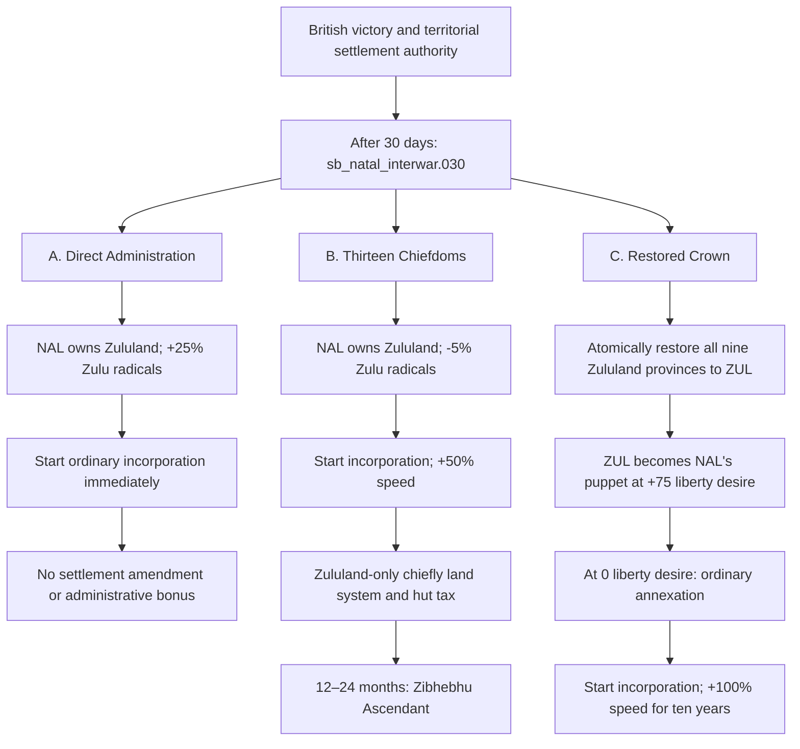
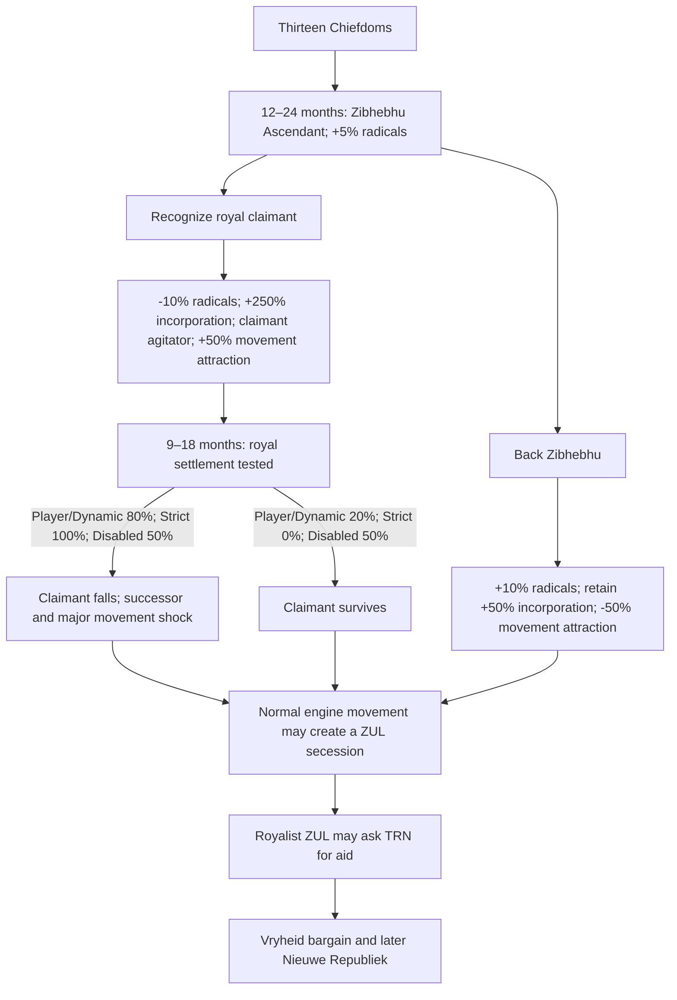

# Natal–Zululand Postwar Settlement Proposal

Status: **superseded pre-implementation snapshot**

> The authoritative design and implementation contract is `Docs/natal_zululand_postwar_settlement_design.md`, especially its Decision register. This snapshot predates the shared Chiefdoms Situation and independent-NRP boundary design.

This document consolidates the agreed design for rebuilding `sb_natal_interwar.030` and its downstream Zululand integration and Zulu-restoration content. The military bridge into the settlement remains open because replacing Britain's annexation play with a protectorate play changes which settlement choices remain meaningful.

## Design goals

- Make all three postwar settlements legible, mechanically distinct, and viable.
- Preserve Victoria 3's ordinary Zulu cultural-national movement and secession mechanics.
- Make the Thirteen Chiefdoms the fastest administrative route, but expose their delayed political instability.
- Make a restored Zulu crown the most stable and slowest route to union.
- Make direct administration the least constrained but most immediately disruptive route.
- Eliminate the fragile one-province ZUL restoration sequence.
- Ensure AI Natal actually begins and can finish incorporation.
- Keep the Shepstone system confined to Natal and the postwar Zululand systems confined to Zululand.

## Entry conditions

Under the current annexation-and-handoff bridge, the settlement begins when:

- NAL is a British colony;
- NAL controls the complete nine-province `STATE_ZULULAND`;
- ZUL no longer owns a state; and
- `sb_natal_interwar.030` is scheduled after 30 days.

If the Anglo-Zulu War changes to a protectorate play, these entry conditions must be replaced by the war-to-settlement bridge described at the end of this proposal.

## Foundation: the ordinary Zulu national movement

When NAL is first created and its intended territory and population have been assigned, it ensures that its normal Zulu `movement_cultural_minority` exists. That movement receives vanilla's `initial_movement_enthusiasm` once:

- +100% political-movement pop attraction;
- decays over twenty years;
- no claimant or agitator is installed by the country-creation hook; and
- the modifier is not refreshed by Boer-to-British transformation, reload, or later maintenance calls.

Later settlement events may shape this same movement and attach a historically appropriate claimant. They must not create a parallel scripted replacement movement.

## Settlement overview

| Route | Territorial form | Incorporation | Political profile |
| --- | --- | --- | --- |
| Direct Administration | NAL directly owns Zululand | Begins immediately at ordinary speed | Largest immediate radical shock; no land, bureaucracy, or chiefly-administration constraints |
| Thirteen Chiefdoms | NAL directly owns Zululand under a locked settlement | Begins immediately at +50%, with a possible historical +250% phase | Best apparent short-term settlement; delayed factional crisis and local land-policy constraints |
| Restored Crown | ZUL remains a separate NAL subject | No progress while separate; ordinary annexation at 0 liberty desire, then +100% speed for ten years | Most stable but slowest overall because autonomy management precedes incorporation |

## Route A: Direct Administration

`sb_natal_interwar.030.a` should:

- add +25% Zulu radicals in `STATE_ZULULAND`;
- ensure the ordinary Zulu national movement exists;
- begin normal incorporation of `STATE_ZULULAND` immediately for both player and AI NAL; and
- apply no settlement amendment, reserve system, hut-tax system, incorporation bonus, or movement suppression.

This is the high-risk, low-constraint route. If the engine later creates a Zulu secession, the claimant and Boer-aid story attaches to that actual uprising.

## Route B: Thirteen Chiefdoms

`sb_natal_interwar.030.b` should:

- reduce Zulu radicals in `STATE_ZULULAND` by 5%;
- begin incorporation immediately;
- apply +50% state incorporation speed; and
- apply a locked, Zululand-only Thirteen Chiefdoms amendment and state package.

The first-test local package is:

- +25% subsistence output;
- 50% protected subsistence employment;
- 15% reserved arable land;
- -15% migration attraction;
- remove the existing -25% qualifications penalty;
- replace the generic +10% food-security bonus rather than stacking it; and
- provisionally add `tax_land_add = 0.05` as the hut tax, subject to a runtime scope and revenue check.

The Shepstone system remains `STATE_NATAL`-only. It neither spills into nor stacks with the Thirteen Chiefdoms package in `STATE_ZULULAND`.

The Thirteen Chiefdoms and its successor, Recognized Zulu Authority, cannot be manually repealed. The settlement ends automatically when Zululand becomes fully incorporated. This incorporation-linked lifecycle supersedes the earlier standalone ten-year repeal lock.

### Delayed partition crisis

After 12–24 months, a visible event, provisionally **Zibhebhu Ascendant**, applies a small unavoidable +5% Zulu radical increase and offers two policies.

#### Recognize the royal claimant

- Replace the Thirteen Chiefdoms with a locked Recognized Zulu Authority amendment.
- Reduce Zulu radicals in Zululand by a provisional 10%.
- Preserve the local reserve and hut-tax system.
- Raise incorporation speed from +50% to the agreed first-test value of +250%.
- Make the actual pre-conquest royal claimant an agitator for the ordinary Zulu movement.
- Apply a provisional +50% movement attraction and -10% movement radicalism while the recognized authority remains.

This route reduces diffuse unrest and greatly improves administrative integration, but concentrates national opposition around a legitimate claimant.

#### Back Zibhebhu and preserve the partition

- Retain the Thirteen Chiefdoms and its +50% incorporation speed.
- Add a provisional further +10% Zulu radical increase.
- Do not install the royal claimant as an agitator.
- Apply a provisional -50% attraction modifier to the Zulu national movement while the partition remains active.
- Do not schedule the claimant-fall event.

This route creates more discontented Zulu pops but keeps royalist resistance fragmented. Zibhebhu remains Natal-aligned and never asks the Boers for support.

### Royal settlement tested

Only the recognized-claimant branch schedules this event, 9–18 months later.

| Controller and AI-history rule | Claimant falls | Settlement holds |
| --- | ---: | ---: |
| Player NAL | 80% | 20% |
| AI NAL — Dynamic Historical | 80% | 20% |
| AI NAL — Strict Historical | 100% | 0% |
| AI NAL — History Disabled | 50% | 50% |

If the claimant falls:

- the claimant is defeated and dies afterward, without asserting an historically unproven assassination;
- the recorded dynastic successor replaces the claimant as agitator;
- Zululand receives a major one-shot radical shock; and
- the Zulu movement receives a stronger radicalism or activism modifier.

If the settlement holds, the claimant survives and remains the movement's agitator; the recognized authority and its integration machinery continue without the succession shock.

The dynasty mapping is:

- Cetshwayo line → Dinuzulu;
- Mbuyazi line → a defined son of Mbuyazi; and
- Dingane/Uthumbo line → a defined next-generation claimant, still requiring historical verification.

The conquered ruler and heir should therefore be preserved as flagged exiles rather than reconstructed later from date checks.

## Route C: Restored Crown

`sb_natal_interwar.030.c` should restore ZUL atomically from NAL's complete `STATE_ZULULAND` region-state:

- all nine Zululand provinces transfer in the same operation;
- ZUL becomes NAL's puppet;
- ZUL begins with +75 liberty desire;
- the appropriate ruler and firearms baseline are restored; and
- there is no seed-province plus one-day completion sequence.

ZUL's ordinary Release Country and Liberate Country footprint should comprise `STATE_NATAL` and `STATE_ZULULAND`. That general footprint does not control this bespoke postwar option: `.030.c` restores Zululand only.

At exactly 0 liberty desire, while both countries are at peace and outside diplomatic plays, **Integrate Restored Zululand** should:

- perform an ordinary annexation, not `annex_with_incorporation`;
- automatically begin incorporating `STATE_ZULULAND`; and
- apply +100% state incorporation speed for ten years.

The incorporation phase should take roughly 12.5–13.6 years after annexation under the expected technology modifiers. Because the autonomy phase comes first, this remains the slowest route overall.

This route currently opts out of the NAL-based claimant, secession, and Boer-aid sequence. A later royalist crisis for a loyal subordinate ZUL remains a separate open design question.

## Engine-driven secession and Boer aid

Settlement events do not directly launch a Zulu rebellion. The ordinary Zulu cultural-national movement must become secessionist through normal Victoria 3 mechanics.

When that engine-driven movement creates ZUL:

- transfer the current royal claimant or successor to ZUL and make that character ruler;
- offer the Boer-aid event to the secessionist ZUL;
- if TRN accepts, continue into the Vryheid land bargain and later Nieuwe Republiek machinery; and
- never route Zibhebhu through the Boer-aid request.

## Incorporation completion and cleanup

Direct Administration and the Thirteen Chiefdoms begin incorporation when `.030` resolves. The Restored Crown begins it only after ordinary annexation at zero liberty desire.

`on_state_incorporation` should schedule a one-shot **The Annexation of Zululand** event when:

- the incorporated state is `STATE_ZULULAND`;
- its owner is NAL;
- a Zululand settlement amendment is active; and
- the completion event has not already resolved.

The event removes the active settlement amendment, state and movement modifiers, bureaucracy-law guard, and hut-tax arrangement. It does not remove the ordinary Zulu national movement or its agitator.

If NAL loses Zululand before completion, orphaned settlement machinery is cleaned up without firing the celebratory event. Canceling incorporation leaves the settlement intact.

## Option presentation

Every material consequence must be visible before selection:

- use raw effect tooltips when they accurately describe the result;
- use custom tooltips only for hidden technical work or effects the engine cannot present cleanly;
- explicitly state territorial outcome, subject status, liberty desire, radical changes, incorporation behavior, locked amendments, and delayed risks; and
- mark every new or rewritten event localization `# ### TO REVIEW ###`.

## Anglo-Zulu War bridge: open decision

The current implementation uses Britain's `dp_annex_war`, followed by a British decision handing the conquered territory to NAL. This cleanly supplies the territorial conditions for all three settlement options, but compresses the historical sequence: Britain defeated Zululand in 1879, partitioned it among thirteen chiefs, annexed British Zululand in 1887, and transferred it to Natal in 1897.

A standard `dp_make_protectorate` is available in vanilla, but its destination materially changes the proposal:

| War outcome | Consequence for the proposal | Assessment |
| --- | --- | --- |
| Keep annex-country and hand territory to NAL | Preserves all three `.030` settlements without another bridge | Simplest and most Natal-player-focused, but historically telescoped |
| Make ZUL a protectorate and immediately transfer it to NAL | Leaves ZUL intact as NAL's subject | Mechanically preselects the Restored Crown and eliminates Direct Administration and the Thirteen Chiefdoms |
| Make ZUL a protectorate and keep it directly under GBR | Preserves a British imperial layer | More remote from the Natal player and requires a later 1887/1897 transfer phase before the postwar content can run |
| Use a temporary GBR protectorate followed by an imperial settlement | The war establishes British supremacy; a prompt settlement then chooses among all three routes | Best historical-mechanical compromise, but requires explicit victory, reparenting, and dissolution wiring |

### Recommended hybrid bridge

Britain opens `dp_make_protectorate` against ZUL. On British victory, ZUL temporarily becomes a direct GBR protectorate. A prompt imperial settlement then preserves the three-way choice:

- **Direct Administration:** dissolve the temporary protectorate, transfer all of `STATE_ZULULAND` to NAL, retire ZUL, and execute Route A.
- **Thirteen Chiefdoms:** dissolve the temporary protectorate, transfer all of `STATE_ZULULAND` to NAL, retire ZUL, and execute Route B.
- **Restored Crown:** reparent the surviving ZUL protectorate from GBR to NAL and apply Route C's +75 liberty desire and restoration setup.

The repository already contains a comparator for scripted reparenting: make the existing subject independent, then have the intended overlord create a new protectorate pact. The bridge still requires dedicated outcome detection because the current Anglo-Zulu cleanup recognizes annex-country and conquer-state plays only.

A plain protectorate is not itself a complete historical settlement: it preserves a centralized Zulu state and ruler, whereas the 1879 settlement deliberately fragmented royal authority. Its strongest use is therefore as the military and diplomatic outcome immediately preceding the three-way political settlement, not as the final settlement by itself.

The remaining design decision is whether this hybrid is worth the additional bridge machinery. If not, the current annex-country play should remain because it preserves the approved Natal-facing postwar choice better than either permanent protectorate alternative.

## Remaining implementation research

- Validate the script syntax and scopes for beginning ordinary state incorporation.
- Runtime-test the `tax_land_add = 0.05` hut-tax effect for state scope and scale.
- Verify the Dingane/Uthumbo-line successor.
- Set first-test values for the claimant-fall movement shock.
- Decide whether the Anglo-Zulu War remains annex-country or adopts the temporary-protectorate hybrid.
- Decide which controller receives the hybrid settlement choice when GBR or NAL is player-controlled.
- Add static and runtime contracts for atomic nine-province restoration, subject reparenting, incorporation start, settlement cleanup, and option tooltip coverage.
