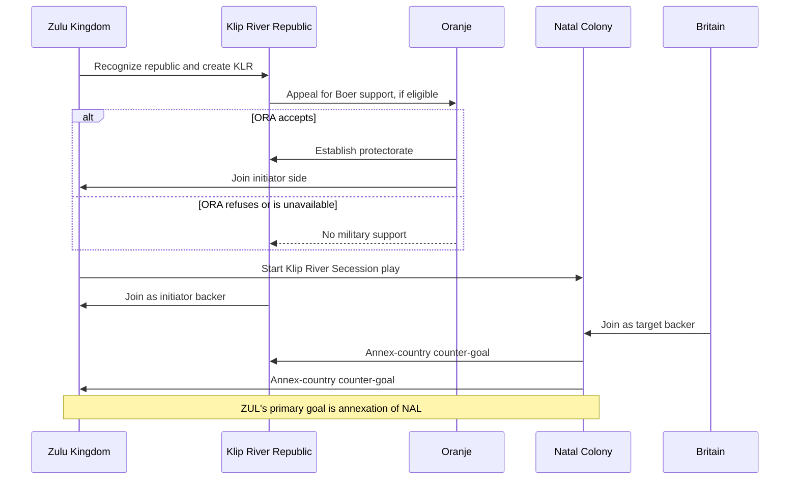
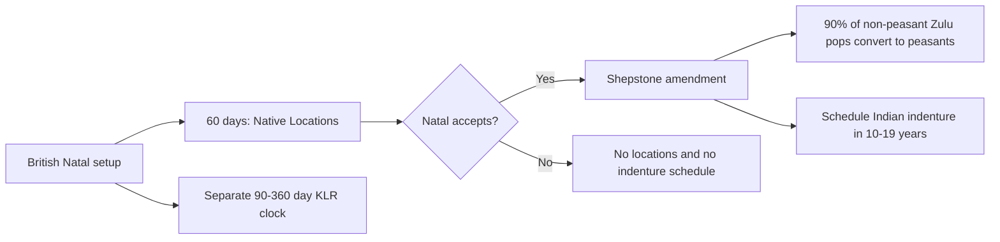
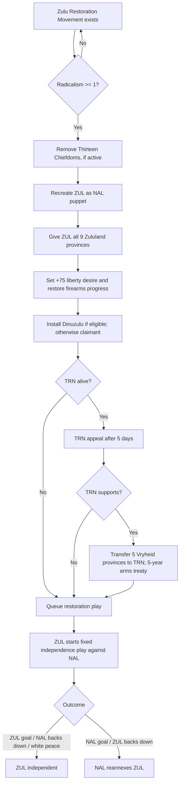

# Klip River to the Dinuzulu Restoration Rebellion

## Live-script chain audit

**Audit date:** 25 August 2026

**Code baseline:** working tree based on commit `9abbd34`; live files, including current uncommitted edits, were treated as authoritative.

**Scope:** British Natal's Klip River boundary question, every KLR and punitive-war outcome, the later route by which Natal can absorb Zululand, the post-annexation governance settlement, the Zulu Restoration Movement, Dinuzulu's character handoff, Transvaal's arms branch, and the final restoration war.

## Executive answer

The live implementation is not one guaranteed linear chain.

- The **shortest route** from Klip River to the Dinuzulu restoration conflict is: British Natal opens the Klip River question; ZUL either backs KLR or rejects Natal outright; Natal wins the resulting war and destroys ZUL; Natal chooses direct integration or the Thirteen Chiefdoms; the Zulu Restoration Movement radicalizes; Zululand is restored as a high-liberty puppet; and restored ZUL launches a fixed independence play against Natal.
- A **Zulu-KLR victory does the opposite**. KLR absorbs the British Natal tag, ZUL takes most of Natal, and British Natal ceases to exist. That outcome normally exits the post-annexation Dinuzulu chain.
- There is no single scripted event called the “Dinuzulu Rebellion.” The rebellion is a state machine composed of a governance event, a political movement, character-selection effects, a restored ZUL puppet, a Transvaal appeal, and a locked diplomatic play.
- Dinuzulu can lead the restoration only from **1 January 1884** onward. An earlier uprising uses a generated Zulu restoration leader. Dinuzulu's historical template has a birth date of 1 January 1868.
- The Great Trek and Klip River identities remain separate: a victorious KLR remains the **Klip River Republic** until it later owns all of `STATE_NATAL` and completes the Natal Great Trek stage, at which point it changes tag to NAL/Natalia.

## 1. Macro chain

```mermaid
flowchart LR
    A[British Natal formed] --> B{Klip River setup valid?}
    B -- No --> X[Standard Boer flight; KLR never opens]
    B -- Yes --> C[Random 90 / 180 / 270 / 360 day delay]
    C --> D{Natal's boundary choice}
    D -- Ratify present border --> E[Boer flight; ZUL keeps xBBCA32]
    D -- Send commissioners --> F{Zulu court choice}
    F -- Recognize Mzinyathi --> G[Natal gains xBBCA32; 25-year truce]
    F -- Back KLR --> H[KLR created; ZUL-led secession play]
    F -- Reject both --> I[Natal punitive annexation play]
    H --> J{War result}
    I --> J
    J -- ZUL destroyed and Natal owns all Zululand --> K[Government of Zululand event]
    J -- ZUL survives or British Natal falls --> Y[No immediate post-annexation chain]
    K --> L{Natal's settlement}
    L -- Direct integration --> M[Zulu Restoration Movement]
    L -- Thirteen Chiefdoms --> M
    L -- Restore subordinate crown --> Z[ZUL puppet; gradual-integration branch, no scripted uprising]
    M --> N{Movement radicalism at least 1}
    N --> O[Restore ZUL puppet at 75 liberty desire]
    O --> P[Dinuzulu if eligible; otherwise generated claimant]
    P --> Q[Optional Transvaal arms and territory bargain]
    Q --> R[Zulu independence vs Natal reannexation play]
```

The Shepstone and indenture content runs beside this chain, not through it. British Natal schedules the Shepstone event for 60 days after colony setup, whereas the Klip River question uses a separate random 90-360 day clock.

## 2. Entry conditions and clocks

British Natal's shared colony setup does two relevant things immediately:

1. schedules **The Native Locations** (`sb_natal_interwar.050`) for 60 days later; and
2. if the Klip River geometry is valid, schedules the boundary question on a uniform four-way choice of 90, 180, 270, or 360 days.

The Klip River setup is valid only when all of the following are true:

- NAL exists as a British subject and carries `sb_natalia_british_colony_resolved_var`;
- NAL owns `xDE0EDE` and `x552449`;
- independent ZUL exists and owns `xBBCA32`;
- the colony was not created through the direct post-ZUL-destruction route marked by `sb_klip_river_direct_colony_excluded_var`.

The commission waits until both NAL and ZUL are outside wars and diplomatic plays. A temporary war does not discard the story: the chain marks itself ready and retries on the monthly pulse. If the territorial setup becomes invalid, it falls back to the standard Boer-flight resolution.

| Beat | Scripted delay or threshold |
|---|---:|
| Shepstone event after British Natal setup | 60 days |
| Klip River hidden delay | 90, 180, 270, or 360 days |
| Natal sends demand to ZUL | 2 days |
| KLR appeal to ORA | 6 days |
| ORA answer to Natal war event | 4 days |
| Zulu governance event after annexation gate | 30 days |
| Transvaal arms appeal | 5 days; 30-day response window |
| Dinuzulu eligibility in restoration logic | `game_date >= 1884.1.1` |
| Restoration uprising | No fixed date; movement radicalism must be `>= 1` |

## 3. Natal's first choice

`sb_klip_river_county.010`, **The Colony's Northern Boundary**, gives NAL two choices.

| Natal choice | Immediate result | AI weight |
|---|---|---:|
| Send the commissioners north | ZUL receives the three-way Klip River decision two days later | 70 base |
| Ratify the present boundary | +25 NAL-ZUL relations, no Zulu decision, and the normal Boer flight | 30 base |

Relations shift the weights toward ratification when relations are good and toward confrontation when they are poor. Under Strict Historical AI, when NAL, ZUL, and GBR are all AI-controlled, the ratification option receives `-1000`; the commission is therefore the intended deterministic route.

## 4. The Zulu court's three-way decision

`sb_klip_river_county.020`, **The Klip River Question**, is the decisive fork.

| Zulu choice | Territory and diplomacy | Dynastic effect | Next step | Base weight |
|---|---|---|---|---:|
| Recognize the Mzinyathi boundary | NAL receives `xBBCA32`; ZUL receives 25-year truces with NAL and GBR | -5 stability; ruler gains Cautious if absent, adding +0.5 monthly stability | Standard Boer flight | 60 |
| Recognize the Klip River Republic | KLR is created in three Natal provinces; ZUL commits to its defense | +5 stability; ruler gains Tactful if absent, adding +0.5 monthly stability | ORA appeal, then ZUL-led secession play | 30 |
| Bow to neither settler | No cession; Natal prepares to annex ZUL | +15 stability; ruler gains Ambitious if absent, adding +2 monthly stability | NAL-led punitive play | 10 |

### Dynamic Zulu AI weights

The following modifiers are additive. Each row preserves a zero-sum shift among the three options.

| Condition | Mzinyathi | Back KLR | Reject both |
|---|---:|---:|---:|
| Zulu dynastic JE exists | +15 | -10 | -5 |
| Zulu dynastic JE absent | -15 | +10 | +5 |
| Firearms fully modernized | -30 | +20 | +10 |
| Firearms JE below 50 progress | +15 | -10 | -5 |
| Firearms JE above 50 progress | -15 | +10 | +5 |
| Dingane is ruler | -15 | +10 | +5 |
| ZUL controls the initial Swazi footprint | -15 | +10 | +5 |

At exactly 50 firearms progress, neither the below-50 nor above-50 modifier applies. Under Strict Historical AI with AI NAL, ZUL, and GBR, the Mzinyathi choice receives `+1000` and the other two receive `-1000`, so the ZUL-backed KLR branch is intentionally excluded from that fully AI strict route.

## 5. What KLR receives

Choosing to back the republic invokes `sb_klip_river_create_county` before the war.

| Component | Live implementation |
|---|---|
| Territory | `xBBCA32`, `xDE0EDE`, `x552449`, all within `STATE_NATAL` |
| Claim | Claim on `STATE_NATAL` only |
| Government | Presidential republic, oligarchy, national supremacy, homesteading, national militia, discrete inboekstelsel |
| Ruler | Andries Theodorus Spies |
| Economy | One maize farm with one reserve |
| Army | One dragoon and one irregular infantry battalion in the Klip River Commando |
| Population staging | 75% of NAL's Boer population is staged into KLR; one tenth of that staged share becomes officers and the remainder soldiers |

The population, farm, and two battalions are historical story assets and are **not** controlled by either artificial-assistance game rule.

## 6. Oranje's appeal

If independent ORA exists, KLR waits six days and asks for support. If ORA accepts, it records the backing, enters the Zulu side of the play, and makes KLR its protectorate. The ORA decision uses an exact four-case matrix:

| ORA condition | Support | Refuse |
|---|---:|---:|
| Great Trek complete; owns all Drakensberg | 90% | 10% |
| Great Trek complete; does not own all Drakensberg | 60% | 40% |
| Great Trek incomplete; owns all Drakensberg | 40% | 60% |
| Great Trek incomplete; does not own all Drakensberg | 10% | 90% |

If ORA is absent, dead, or a subject, Natal proceeds directly to the war event without the appeal.

## 7. ZUL backs KLR: actors, goals, and assistance

The live play is deliberately asymmetric:

- **Initiator:** ZUL
- **Target:** NAL
- **Automatic Zulu backers:** KLR and, if pledged, ORA
- **Automatic Natal backer:** GBR
- **Zulu primary goal:** annex NAL
- **Natal counter-goals:** annex KLR and annex ZUL
- Both sides may add further war goals.

AI ZUL receives a high-boldness strategy while the play is active so it does not casually abandon KLR during escalation.

### Optional artificial assistance

KLR's permanent story packet always exists. Only the following temporary combat roll is rule-gated:

| Condition | Chance of package | KLR package | ZUL package |
|---|---:|---|---|
| Dingane is Honorable and ZUL has an East Transvaal region state | 70% | Laager for 15 months | Northern Natal Muster for 12 months |
| Otherwise | 30% | Laager for 15 months | Northern Natal Muster for 12 months |

The package is applied per AI recipient only when either the Player Challenge rule covers an opposing player NAL/GBR or the AI History rule covers an all-AI NAL/GBR opposition.

- Player-Challenge Laager: +75% recovery, +50% kill rate, +10% defense.
- AI-History Laager: +1000 training, -100% battle casualties, +75% recovery, +125% kill rate, -100% supply consumption, +50% organization gain.
- Zulu muster: +10% offense, +10% defense, +10% organization gain.

## 8. KLR secession outcomes

| Result | Scripted settlement | KLR fate | ZUL fate | Route toward Dinuzulu restoration |
|---|---|---|---|---|
| ZUL enforces annexation of NAL, or NAL backs down | `sb_klip_river_finalize_reduced_natalia` | KLR annexes NAL but retains KLR tag and its three provinces | ZUL receives the other ten Natal provinces and all Zululand | **Stops.** No British NAL and ZUL survives |
| NAL enforces annexation of ZUL | Colonial status quo finalizer | KLR is annexed by NAL; Boer flight event follows | ZUL is destroyed by the enforced goal | **Direct bridge** to post-annexation settlement if NAL owns all nine Zululand provinces |
| NAL enforces annexation of KLR only | County-annexation marker, then secession-war end | KLR destroyed; Boer flight event `.091` | ZUL survives | No immediate bridge; later ZUL conquest is required |
| War ends without decisive scripted goal | Secession white-peace finalizer | KLR survives if not already annexed | ZUL survives | No immediate bridge |
| ZUL backs down during escalation | Colonial status quo finalizer | KLR annexed by NAL | Engine-applied counter-goals determine ZUL's final ownership before cleanup | Potential bridge only if ZUL is actually destroyed |

### Reduced Natalia is still KLR

On a Zulu-coalition victory:

| Holder | `STATE_NATAL` provinces after settlement |
|---|---|
| KLR | `xBBCA32`, `xDE0EDE`, `x552449` |
| ZUL | `x279045`, `x5B124F`, `xFF0EF1`, `xE0EB02`, `x85695F`, `x7ACC38`, `xB1F868`, `x3CED3D`, `x11A090`, `xCD31DB` |

ZUL also keeps all nine provinces of `STATE_ZULULAND`. KLR receives Natalia's Boer-republic setup, but it is not renamed. It must later conquer all of `STATE_NATAL`, complete the Natal Great Trek stage, add the Boer homeland to Natal, and only then execute `change_tag = NAL`.

If ORA backed the rebellion, victorious KLR remains or is re-established as an ORA protectorate.

## 9. The alternative punitive branch

If ZUL rejects both Natal and KLR, Natal starts `dp_sb_klip_river_punitive_expedition`:

- NAL is initiator and seeks to annex ZUL;
- GBR is an automatic NAL backer;
- ZUL receives a return-state goal against NAL's `STATE_NATAL` region state;
- before the play, a future Boer-refugee receiver is persisted from ORA, TRN, ZPB, or LYD.

If the artificial-assistance gate is active and ZUL has the Dingane/Honorable/East-Transvaal advantage, ZUL has a 60% chance to receive the 12-month Northern Natal Muster. Without that advantage, this punitive branch supplies no scripted combat roll.

| Punitive result | Settlement | Dinuzulu route |
|---|---|---|
| NAL wins / ZUL backs down | ZUL is annexed; event `.080`; standard Boer flight | Direct bridge if NAL owns all Zululand |
| ZUL wins / NAL backs down | Return-state result plus 95% Boer-refugee movement to the persisted receiver | Stops; ZUL survives |
| White peace | Event `.081`; British rule survives but ZUL also survives | Later conquest required |

## 10. From a surviving ZUL to later annexation

Peaceful KLR outcomes do not themselves create the Dinuzulu conflict. Natal must later destroy ZUL and own the complete nine-province Zululand footprint.

The mod's explicit later bridge is the Anglo-Zulu pressure route:

1. AI NAL must be a subject, have Civilizing Mission, and be idle.
2. ZUL must be alive and idle.
3. NAL issues **Ultimatum to Ulundi** and opens a locked return-state play.
4. A Zulu victory adds 50 firearms-adoption progress.
5. A Natal victory resolves the frontier in Natal's favor; British-held conquered territory can also be handed to NAL.
6. Once NAL owns all nine Zululand provinces and ZUL has no state, the post-annexation settlement becomes ready.

### Current reachability caveat

Both the decision and `sb_anglo_zulu.010` require `is_ai = yes`. The decision's AI chance is zero unless `sb_nal_anglo_zulu_accelerated_var` has been set by the Imperial Confederation route, which then directly schedules the event after 30 days. A player-controlled NAL has no player-facing entry through this decision file. This is a live implementation fact, not an inference from the design notes.

The peaceful Mzinyathi branch also creates a 25-year NAL-ZUL and GBR-ZUL truce, naturally delaying any later aggressive play until the truce or a separate script permits it.

## 11. Parallel British Natal administration

The Shepstone/indenture line is chronologically adjacent but not a prerequisite for Dinuzulu's restoration.

Acceptance also gives 20% Zulu loyalists, makes 10% of fully accepted pops more radical, and applies five-year interest-group reactions. Refusal gives 35% Zulu radicals, improves fully accepted-pop loyalty by 10%, and worsens relations with Britain by 10.

## 12. Post-annexation governance gate

The monthly pulse schedules `sb_natal_interwar.030`, **The Government of Zululand**, when:

- NAL is a British colony;
- NAL owns all nine northern Zulu-core provinces;
- ZUL owns no state; and
- the settlement has not already resolved.

The event is scheduled 30 days later. While ZUL still exists under a British Natal, its firearms progress is archived into NAL every month and immediately before enforced war goals can destroy it. A later restored ZUL inherits that progress.

## 13. Three governance settlements

| Choice | Immediate effects | Later rebellion behavior | Base AI weight |
|---|---|---|---:|
| Force integration into Natal | +25% Zulu radicals; create Zulu Restoration Movement | Fastest likely path to the movement threshold | 20 |
| Divide Zululand among Thirteen Chiefs | -5% Zulu radicals; Imperial Administration amendment; -25% qualifications, +10% food security, reduced radicalism/prejudice effects; create movement | Movement remains, but indirect rule can delay radicalization | 60 |
| Restore the Crown beneath imperial rule | Immediately restore all nine provinces as a ZUL puppet with +75 liberty desire | No scripted movement uprising; gradual-integration branch instead | 20 |

Under Strict Historical AI, the Thirteen Chiefdoms receives `+1000`; the other two receive `-1000`.

The chiefdom amendment cannot be repealed directly. After its five-year cooldown, Natal can dismantle it by decision, adding 10% Zulu radicals. Attempts to reform the protected bureaucracy while the amendment stands are cancelled and produce the explanatory event **The Chiefdom Settlement Stands**.

The gradual-restoration option can later re-annex ZUL only when it is a direct puppet of NAL, is idle, and has liberty desire at or below zero.

## 14. How Dinuzulu enters the movement

The direct-integration and Thirteen-Chiefdoms choices create `movement_sb_zulu_restoration` and then call the claimant assurance effect.

From 1 January 1884 onward, the effect tries in this order:

1. use an existing living Dinuzulu in NAL;
2. find a living Dinuzulu in another country, transfer him to NAL, and make him an agitator;
3. if he has never been created globally, create the historical Dinuzulu template as an agitator; or
4. if none of the above can produce a usable character, create a generated 30-year-old Zulu ethno-nationalist agitator.

Before 1884, only the generated restoration leader is guaranteed. The movement continues to check monthly, so Dinuzulu can be added later if the movement still exists and the global creation guard permits it.

There is a separate continuity path in an independent ZUL: Mpande's Cetshwayo succession event can call `sb_zulu_prepare_dinuzulu_heir`. If that living template survives elsewhere after annexation, the restoration chain can recover and transfer him.

## 15. The uprising state machine

The restoration trigger has no fixed year beyond Dinuzulu's character gate. It fires on a monthly pulse as soon as the movement's radicalism reaches the literal script threshold `>= 1`, provided NAL still owns all Zululand and no ZUL country is alive.

## 16. Transvaal's arms branch

Once the uprising begins, restored ZUL appeals to TRN if TRN is alive. TRN has five days before seeing the event, while NAL keeps a 30-day fallback timer so the war cannot wait forever.

If TRN accepts and the treaty is valid:

- TRN receives `xE1E455`, `xE882CE`, `x1A084B`, `xBFA16B`, and `x41C070`;
- TRN gains 2.5 infamy;
- TRN loses 15 relations with NAL and 5 with GBR;
- TRN gives ZUL Military Assistance for five years; and
- TRN transfers 10 Small Arms to ZUL for five years.

TRN's base weights are 60 to support and 40 to refuse. Support becomes more likely when TRN participates in the Imperial Confederation or Bechuanaland story, rivals or opposes Britain/Natal, or has poor British relations. It becomes less likely in Britain's power bloc, under a British security treaty, during default/bankruptcy, or with good British relations.

The five transferred provinces are moved before the restoration war. Neither final restoration settlement explicitly returns them. Thus, in the live script, they remain with TRN whether the remaining ZUL puppet wins independence or Natal reannexes it.

## 17. Final restoration play and results

`dp_sb_zulu_restoration_secession` is tightly locked:

- ZUL initiates against its direct overlord NAL;
- ZUL's fixed primary goal is independence;
- NAL receives a fixed annex-ZUL counter-goal;
- neither side may add further goals; and
- AI ZUL receives a high-boldness resistance strategy.

| Resolution | Finalizer | Result |
|---|---|---|
| ZUL independence goal enforced | `sb_natal_finalize_zulu_independence` | ZUL becomes independent; both tags mark the restoration resolved |
| NAL annexation goal enforced | `sb_natal_finalize_zulu_reannexation` | NAL annexes ZUL and resolves the chain |
| NAL backs down | Independence finalizer | ZUL becomes independent |
| ZUL backs down | Reannexation finalizer | NAL annexes ZUL |
| War ends without an enforced terminal goal | Independence finalizer | White peace favors Zulu independence |

## 18. What the ZUL-backed KLR branch means for the long arc

The ZUL-backed KLR branch is a genuine alternate-history exit, not merely an early battle on rails.

- **Zulu-KLR victory:** ZUL controls most of Natal and all Zululand; KLR survives in three provinces and absorbs the British colony tag. There is no British NAL to administer annexed Zululand, so the Government of Zululand event and the Dinuzulu restoration state machine cannot open.
- **British/Natal victory that destroys both KLR and ZUL:** this is the most direct KLR-to-Dinuzulu route. It resolves the Boer frontier and immediately supplies the territorial precondition for the later governance event.
- **Partial Natal victory that only destroys KLR:** the KLR story ends, but ZUL remains an independent kingdom. Dinuzulu's later restoration requires a separate conquest.
- **White peace:** KLR and ZUL can both survive. The post-annexation chain remains closed.

Therefore, backing KLR raises Zulu dynastic stability and creates a possible future Dinuzulu **dynasty**, but a victory prevents the scripted Dinuzulu **restoration rebellion**. The rebellion requires the kingdom to be destroyed first.

## 19. Current implementation notes worth remembering

1. **The rebellion can predate Dinuzulu.** Before 1884, the restored king is a generated claimant.
2. **Player NAL lacks the explicit Anglo-Zulu decision route.** The decision and event are AI-only in the live file.
3. **Strict Historical AI avoids the KLR alliance.** It forces the Mzinyathi cession in the full AI-AI case.
4. **KLR is not renamed on victory.** Only completing the Great Trek while owning all Natal changes KLR to NAL.
5. **The Thirteen Chiefdoms is transitional, not terminal.** It creates the same restoration movement as direct integration, but begins with fewer Zulu radicals and a protective state modifier.
6. **White peace in the final restoration war grants independence.** This is an explicit finalizer, not an emergent engine default.
7. **Transvaal's territorial payment persists.** The five Vryheid provinces are outside both finalizers.
8. **The post-annexation gate is footprint-exact.** NAL must own all nine listed Zululand provinces and ZUL must own no state.
9. **Firearms progress survives annexation.** NAL archives it and restores it to recreated ZUL.
10. **The KLR combat floor is not a game-rule assist.** The maize farm, population staging, dragoon, and irregular are unconditional story content; only temporary Laager/Muster rolls are rule-gated.

## 20. Source map

| Concern | Live source |
|---|---|
| British Natal setup, Shepstone schedule, KLR schedule | `common/scripted_effects/sb_natalia_colony_effects.txt:136-250,468-493` |
| KLR setup gates | `common/scripted_triggers/sb_klip_river_county_triggers.txt:3-41` |
| KLR events and AI choices | `events/sb_klip_river_county_events.txt:5-615` |
| KLR creation, wars, and finalizers | `common/scripted_effects/sb_klip_river_county_effects.txt:3-892` |
| KLR and restoration diplomatic plays | `common/diplomatic_plays/sb_diplomatic_plays.txt:652-736` |
| KLR and restoration game-rule gates | `common/scripted_triggers/sb_game_rule_triggers.txt:81-124` |
| KLR and restoration AI resistance strategies | `common/ai_strategies/sb_ai_strategies.txt:194-239` |
| Zulu stability bar and KLR trait drift | `common/scripted_progress_bars/sb_progress_bars.txt:675-823` |
| KLR Great Trek conversion | `common/journal_entries/1-02_sb_great_trek.txt:40-70,204-214`; `common/scripted_effects/sb_trek_migration.txt:118-130` |
| Anglo-Zulu bridge | `common/decisions/sb_anglo_zulu_decisions.txt:1-42`; `events/sb_anglo_zulu_events.txt:3-203` |
| Post-annexation event choices | `events/sb_natal_interwar_events.txt:138-325` |
| Settlement gates | `common/scripted_triggers/sb_natal_interwar_triggers.txt:147-231` |
| Restoration movement | `common/political_movements/sb_natal_interwar_movements.txt:106-205` |
| Restoration country, claimant, TRN appeal, play, finalizers | `common/scripted_effects/sb_natal_interwar_effects.txt:635-1196` |
| Dinuzulu template and independent-ZUL heir creation | `common/character_templates/sb_zulu_dynasty_characters.txt:80-93`; `common/scripted_effects/sb_zulu_dynasty_succession_effects.txt:175-203` |
| Wargoal, backdown, and war-end routing | `common/on_actions/sb_diplomatic_play_on_action_handlers.txt:160-170,406-415,633-652` |

## 21. Recommended playtest checkpoints

1. Save immediately before `sb_klip_river_county.020`; inspect all three Zulu choices and stability changes.
2. On the KLR branch, verify the three provinces, Boer-pop staging, maize farm, Spies, and the two-unit commando before the diplomatic play opens.
3. Test ORA's four probability states and confirm protectorate creation only on support.
4. Resolve the secession play four ways: ZUL victory, full NAL victory, KLR-only annexation, and white peace.
5. Confirm a ZUL victory leaves KLR named Klip River Republic until it owns all Natal and completes the Great Trek.
6. On a Natal victory that destroys ZUL, confirm firearms are archived and the Government of Zululand appears only after NAL owns all nine provinces.
7. Test all three governance options, especially the absence of a movement on gradual restoration.
8. Trigger the movement before and after 1884 to distinguish the generated claimant from Dinuzulu.
9. Accept and refuse the Transvaal arms appeal; verify the five-province transfer and five-year treaty.
10. Resolve the restoration play by both enforced goals, both backdowns, and white peace; verify that white peace produces Zulu independence.
